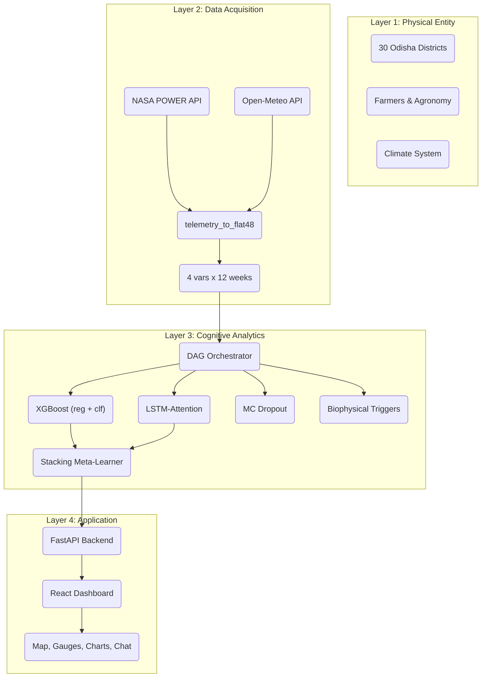

# Cognitive Digital Twin — Odisha Rice Yield Prediction

[](https://fastapi.tiangolo.com)
[](https://react.dev)
[](https://pytorch.org)
[](https://xgboost.readthedocs.io)
[](LICENSE)

A **cognitive digital twin** for rice yield prediction and crop-failure risk assessment across **30 districts** of Odisha, India, spanning **2 seasons** (Kharif / Rabi) over **2006–2024**. The system fuses a **dual-track stacked ensemble** (LSTM-attention + XGBoost) with real-time weather data, biophysical trigger detection, and an LLM-powered advisory layer — all served through an interactive React dashboard.

---

## Overview

| Layer | What it does |
|---|---|
| **Data Acquisition** | Fetches historical weather from **NASA POWER** and live data from **Open-Meteo** — both reduced to a unified **4 variables x 12 weeks** schema |
| **Cognitive Engine** | A **DAG orchestrator** routes 5 query types through 5 model nodes (XGBoost regression, XGBoost classification, LSTM+attention, Monte Carlo Dropout, biophysical triggers) and compiles a stacked ensemble prediction |
| **LLM Advisory** | Provider-agnostic — user provides any OpenAI-compatible API key + model name; generates bilingual (English/Odia) advisories from predictions and active triggers |
| **Dashboard** | React 19 + Vite frontend with Leaflet map, live telemetry gauges, prediction streams, what-if simulator, and historical replay |

### Key results (measured on held-out test set)

| Model | Yield R² | RMSE (Q/A) | Failure AUC | Failure F1@0.5 |
|---|---|---|---|---|
| LSTM-Attention (84-step, 56K params) | 0.641 | 4.05 | 0.685 | 0.400 |
| XGBoost (23 features, 500 trees) | 0.682 | 3.81 | 0.663 | 0.425 |
| **Stacked Ensemble** (val-calibrated) | **0.712** | **3.63** | **0.721** | **0.455** |

---

## Features

- **Interactive Map** — Leaflet-based GIS of Odisha's 30 districts; point-in-polygon ray-casting selects the correct district from a pinned coordinate
- **Live Real-Time Monitor** — polls Open-Meteo every 60 s; a 1-second interpolation ticker smoothly blends readings between polls; 4 gauge cards (temperature, humidity, precipitation, soil moisture) + live telemetry and prediction stream charts
- **What-If Simulator** — adjust climate sliders to explore counterfactual yield and failure risk scenarios
- **LLM Advisory Chat** — ask agronomic questions in natural language; the configured LLM generates bilingual (English/Odia) responses grounded in the twin's current state
- **Historical Replay** — replay past seasons via WebSocket at configurable speed (reads 30 real daily telemetry CSVs)
- **Biophysical Triggers** — rule-based detection of Submergence Flooding, Drought Stress, Thermal Sterility, and Pest/Pathogen Risk with severity levels
- **Model Retraining Pipeline** — endpoints to validate new data, fetch telemetry, merge, backup, retrain, and version the ensemble (`/api/pipeline/*`)
- **Monte Carlo Dropout** — uncertainty quantification via 500 stochastic forward passes; returns confidence intervals and distributions

---

## Tech Stack

### Frontend (`frontend/`)
- **React 19** + **Vite 8** — single-page application, no TypeScript, no routing library
- **Leaflet** + **react-leaflet** — map rendering with GeoJSON district boundaries
- **Recharts** — telemetry stream charts and prediction history
- **Lucide React** — icon set
- Dark glassmorphism theme with IBM Carbon–inspired color tokens (self-hosted IBM Plex Sans/Mono fonts)

### Backend (`backend/`)
- **FastAPI** — ~20 REST endpoints + WebSocket (`/ws/farm-stream`)
- **Uvicorn** — ASGI server
- **httpx** — async HTTP calls to NASA POWER and Open-Meteo
- **LLM client** — OpenAI-compatible (uses provider API key + model name from `.env`)

### Machine Learning (`code/phase-2-training/`)
- **PyTorch** — `LSTMAttention` (hidden=64, layers=2, embedding 30→8, dropout=0.2, seq_len=84)
- **XGBoost** — 23 features, 500 trees, max_depth=4
- **Scikit-learn** — Ridge meta-learner for stacking (Yield weights: `0.2*LSTM + 0.8*XGBoost`; Failure weights: `0.68*LSTM + 0.32*XGBoost`)
- **DAG Orchestrator** — custom Python DAG with 5 node types

### Data Sources
- **NASA POWER** — historical daily telemetry (1981–2026), 30 daily CSV files, ~16,587 rows each
- **Open-Meteo** — live `current` + 16-day hourly forecast (single call)
- **Final dataset** — 1,113 records, 30 districts x 2 seasons, 0 interpolated rows

---

## Project Structure

```
Cognitive-Digital-Twin-Odisha/
├── backend/
│   ├── main.py              # FastAPI app (~1250 lines, 20+ endpoints)
│   ├── llm_client.py        # LLM client for advisory chat
│   ├── requirements.txt     # Python dependencies
│   └── .env.example         # Backend env template
├── frontend/
│   ├── src/
│   │   ├── App.jsx          # Main app (coordinate pinning, stream control)
│   │   ├── components/
│   │   │   ├── Dashboard.jsx
│   │   │   ├── OdishaGISMap.jsx
│   │   │   ├── RealTimeMonitor.jsx  # 60s poll + 1s interpolation
│   │   │   ├── DSSChat.jsx
│   │   │   ├── SimulatorPage.jsx
│   │   │   ├── HistoricalReplay.jsx
│   │   │   ├── MetricsCard.jsx
│   │   │   ├── Heatmap.jsx
│   │   │   ├── Timeline.jsx
│   │   │   └── MapCard.jsx
│   │   └── index.css        # Dark glassmorphism theme (~900 lines)
│   ├── package.json
│   └── .env.example
├── code/phase-2-training/
│   ├── predict.py           # CDTPredictor class (inference + triggers)
│   ├── train.py             # LSTMAttention + XGBoost + stacking training
│   ├── prepare_data.py      # Feature engineering and train/val/test split
│   ├── orchestrator.py      # DAG router (5 query types, 5 model nodes)
│   ├── evaluate_metrics.py  # Independent metric computation on saved models
│   ├── update_pipeline.py   # Full retraining pipeline (end-to-end)
│   ├── metrics_eval.json    # Measured metrics output
│   └── version.json         # Current model version + pipeline metadata
├── .gitignore
└── AGENTS.md
```

---

## Quick Start

### Prerequisites
- Python 3.10+
- Node.js 22+
- Git

### Backend

```powershell
cd backend
pip install -r requirements.txt

# Set your LLM provider credentials
# Create backend/.env (gitignored) with:
# LLM_API_KEY=your_key_here
# LLM_MODEL=provider/model-name   (e.g. openai/gpt-4o or any OpenAI-compatible)

python -m uvicorn main:app --host 0.0.0.0 --port 8000
```

### Frontend

```powershell
cd frontend
npm install
npm run dev          # Vite dev server on http://localhost:5173
```

### Train the models (optional, required for prediction)

```powershell
cd code/phase-2-training
python prepare_data.py
python train.py
```

---

## API Endpoints (summary)

| Method | Path | Purpose |
|---|---|---|
| GET | `/` | Service status + dataset info |
| GET | `/api/districts` | List all 30 districts |
| GET | `/api/history/{district}/{season}` | Historical yield records |
| GET | `/api/telemetry/{district}/{year}/{season}` | Weather telemetry for a district/season |
| GET | `/api/predict/{district}/{year}/{season}` | Full prediction (routing via orchestrator) |
| POST | `/api/predict/coordinate` | Prediction from a pinned lat/lon coordinate |
| POST | `/api/realtime/coordinate` | Live telemetry + prediction (Open-Meteo, 60s poll) |
| POST | `/api/simulate` | What-if scenario with modified weather sliders |
| POST | `/api/ask` | LLM advisory query (provider-agnostic) |
| POST | `/api/stream/start` | Start historical replay via WebSocket |
| POST | `/api/stream/stop` / `pause` / `resume` / `speed` | Stream control |
| GET | `/api/pipeline/check` | Check for new data to retrain |
| POST | `/api/pipeline/update` | Trigger end-to-end retraining pipeline |
| GET | `/api/pipeline/status/{task_id}` | Pipeline job status |
| GET | `/api/pipeline/version` | Current model version and metrics |
| WS | `/ws/farm-stream` | WebSocket for real-time telemetry streaming |

---

## Architecture (4-Layer)



---

## Measured Performance

Metrics computed independently via `evaluate_metrics.py` on seed-42 test partition (n=223, ~28% failure base rate).

| Metric | LSTM | XGBoost | Stacked | Naive Avg |
|---|---|---|---|---|
| Yield R² | 0.641 | 0.682 | **0.712** | 0.711 |
| RMSE (Q/Acre) | 4.05 | 3.81 | **3.63** | 3.63 |
| Failure AUC | 0.685 | 0.663 | **0.721** | 0.709 |
| Failure F1@0.5 | 0.400 | 0.425 | **0.455** | — |
| Failure F1@optimal | — | — | **0.538** (thresh=0.42) | — |
| Precision | — | — | 0.714 | — |
| Recall | — | — | 0.452 | — |

RMSE bounds: 0 (perfect) / 6.75 (naive-mean baseline) / 39.15 (theoretical max). Test yield range 0–39.146 Q/Acre.

---

## Acknowledgments

This project was developed as part of a research internship. Data sources include NASA POWER (Agroclimatology community) and Open-Meteo. The LLM advisory component is provider-agnostic — any OpenAI-compatible API can be used.
