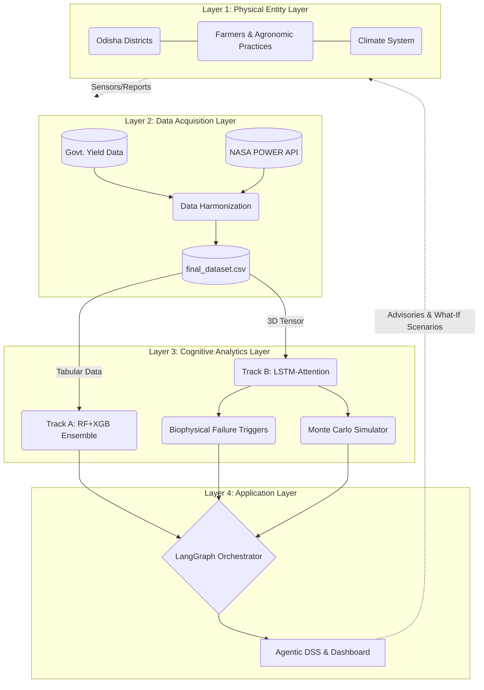
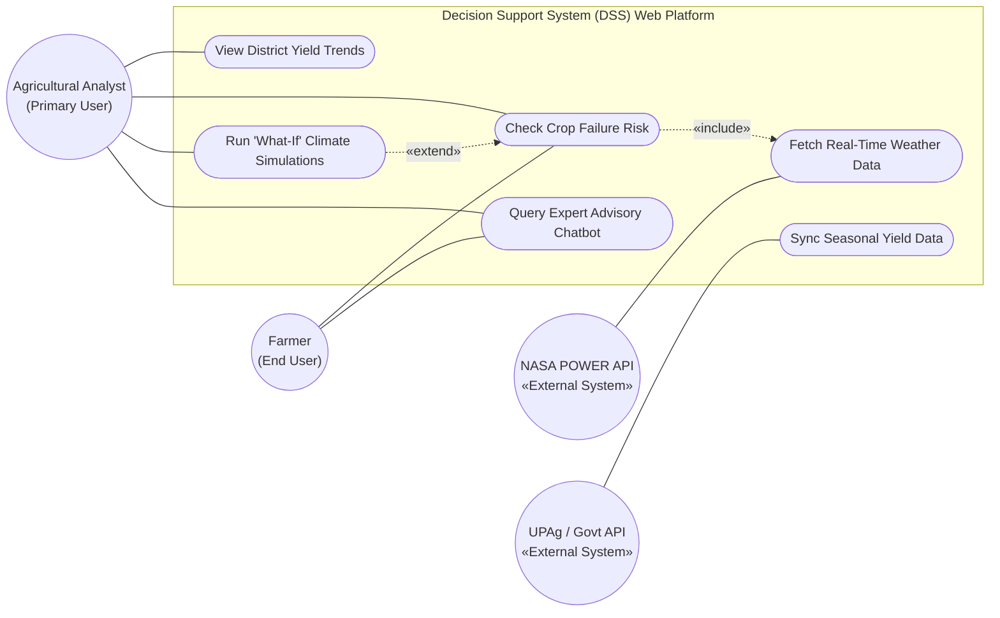
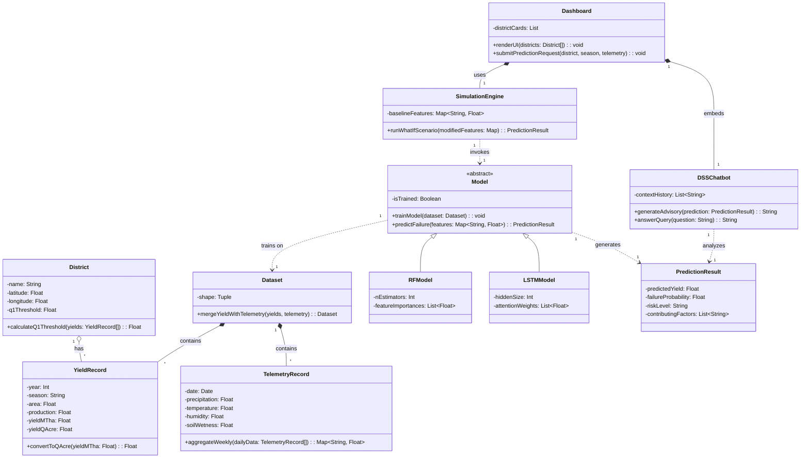
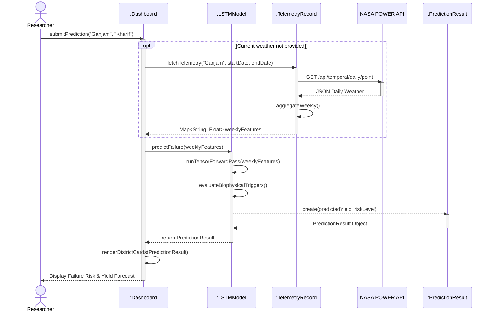

# Progress Review Meeting - 1 (PPT Content)
**Tentative Date:** 23/06/2026

This document contains all the detailed text, tables, and UML diagrams mapped exactly to the `Slide_format1.docx` flow. You can copy and paste this directly into your presentation slides.

---

## Slide 1: Title & Group Members
**Title:** Development of a Cognitive Digital Twin Framework for Crop Yield Forecasting and Climate-Induced Failure Anomaly Detection
**Project Scope:** Odisha Pilot Engine (District-Stratified)
**Group Members:**
- [Insert Name 1]
- [Insert Name 2]
- [Insert Name 3]

---

## Slide 2: Planning Phase

### 2.1 Problem Domain
- **Primary Domain:** Agricultural Technology (AgriTech) & Artificial Intelligence
- **Sub-Domains:** Cognitive Digital Twins (CDT), Predictive Analytics, Deep Learning (LSTM), Remote Sensing (Satellite Telemetry).
- **Core Focus:** Building a continuous, data-driven feedback loop for proactive crop failure detection.

### 2.2 Problem Description (100-200 words)
Currently, agricultural yield forecasting relies heavily on retrospective government statistics that lack real-time predictive capabilities. When climate-induced anomalies—such as severe droughts, extreme thermal stress, or flooding—occur, traditional regression models fail to accurately classify the probability of a crop failure in time for intervention. Furthermore, "black box" deep learning models provide predictions without actionable explanations, reducing trust among stakeholders. There is a critical need for an intelligent system that can continuously ingest environmental telemetry, model biophysical failure triggers, account for weather uncertainty, and provide explainable AI insights. A Cognitive Digital Twin (CDT) solves this by replicating the physical agricultural state digitally, allowing for proactive decision-making and counterfactual "What-If" climate simulations.

### 2.3 Literature Reviews
- **Andini & Utomo (2021)**: Utilized RNN-LSTM networks for 1-month climate forecasting, achieving a 3.29% MAPE. *Limitation*: Only forecasted climate, not crop yield.
- **Yan et al. (2025)**: Proposed a Weighted Ensemble of Random Forest and XGBoost for crop yield time-series data, significantly reducing mean absolute error. *Limitation*: Predicted continuous yield volume but ignored binary disaster classification.
- **Kenneth (2026)**: Developed "CropTwin," utilizing the NASA POWER API and Monte Carlo simulations to handle weather uncertainty. *Limitation*: Ignored biotic stress factors (pests/diseases).
- **Arya et al. (2026)**: Developed a Hybrid Multi-Model ML Framework (ETS-ANN and LSTM) highlighting high predictive accuracy for staple crops (Rice) vs. high variability in others. 

### 2.4 Research Gaps
1. **The Labeling Gap**: Existing research predicts pure yield volume ($t/ha$), whereas disaster relief requires binary classification of a "Failure Anomaly."
2. **The Explainability Gap**: Deep learning models act as a "black box." There is a need to map mathematical features (LSTM attention weights) to real-world biophysical triggers (drought, thermal sterility).
3. **The Macro-to-Micro Bridge**: High infrastructure costs prevent local sensor deployment for smallholders. District-stratified macro-data (NASA POWER) must be accurately transformed into field-level risk proxies.

### 2.5 Problem Statement (2-3 lines)
*Note: This was labeled as 2.3 in the docx by mistake.*
To design and develop a Cognitive Digital Twin that integrates 20 years of historical yield data with continuous NASA POWER weather telemetry to accurately forecast crop yield, classify failure anomalies using a dual-track ML/DL engine, and provide explainable decision support via "what-if" simulations.

---

## Slide 3: Analysis Phase

### 3.1 Functional Requirements (Tabular Format)
*Copy this table directly into your slide.*

| FR ID | Name | Input | Output / Result |
|---|---|---|---|
| **FR-01** | **Ingest Historical Data** | Raw district yield CSVs (1997-2025) | Standardised, aggregated yield records |
| **FR-02** | **Interpolate Data Gaps** | Yield records with missing years | Continuous 20-year grid (1,200 rows) |
| **FR-03** | **Calculate Anomalies** | Interpolated 20-year dataset | $Q_1$ thresholds & Binary Failure labels |
| **FR-04** | **Fetch Weather Telemetry** | District coordinates, Date range | Cached NASA POWER daily CSVs |
| **FR-05** | **Aggregate 12-Week Window**| Yield records + Daily telemetry | Merged ML dataset (1,200 rows × 58 cols) |
| **FR-06** | **Train Predictive Models** | Merged dataset (Tabular & 3D Tensor) | Serialized RF/XGB and LSTM model weights |
| **FR-07** | **Predict Crop Failure** | Telemetry vectors + Season/District | Yield prediction, Failure probability, Risk |
| **FR-08** | **Visualise Summaries** | Prediction results | Interactive Map, District Cards, Trend Lines |
| **FR-09** | **Run What-If Simulations** | User-adjusted climate sliders | Counterfactual yield & risk prediction |

### 3.2 Technology Stack Requirements
- **Data Engineering**: Python, Pandas, NumPy, NASA POWER API (Agroclimatology).
- **Machine Learning (Track A & B)**: Scikit-Learn (Random Forest, XGBoost), PyTorch / TensorFlow (LSTM + Temporal Attention Layer).
- **Backend / Orchestration**: FastAPI (REST endpoints), LangGraph (Agentic DSS & Guardrails).
- **Frontend / Visualisation**: React + Vite, Recharts, Leaflet GIS, Custom SVG, Vanilla CSS (Glassmorphism).

---

## Slide 4: Design Phase

### 4.1 System Model / Architecture
*This diagram shows the 4-layer Cognitive Digital Twin architecture.*

### 4.2 Use-Case Diagram
*This defines the system boundaries and actor interactions.*

### 4.3 Class Diagram
*Extracted via OOAD Abbott's Technique, identifying the core data structures and operations.*

### 4.4 Sequence Diagram
*Shows the behavioral timeline for the "Predict Crop Failure" (UC7) operation.*

---

## Slide 5: Conclusion & Roadmap

**Conclusion:**
The Cognitive Digital Twin framework successfully bridges the gap between static yield reporting and proactive failure anomaly detection. By integrating 20 years of harmonised data with automated NASA satellite telemetry, the system provides an explainable, interactive Decision Support System (DSS). It empowers stakeholders to evaluate counterfactual "what-if" scenarios, transforming agricultural crisis response into resilience planning.

**Roadmap (Next Steps):**
- **Phase 1:** Data Engineering Pipeline & Telemetry Ingestion (Completed).
- **Phase 2:** Model Training (RF & LSTM-Attention) & Validation.
- **Phase 3:** LangGraph Agent Integration & Explainability Triggers.
- **Phase 4:** Frontend GIS Dashboard Deployment & User Testing.

---

## Slide 6: References
1. Abbott, R. J. (1983). *Program Design by Informal English Descriptions*.
2. Andini, A. & Utomo, P. (2021). *Climate Prediction Using RNN LSTM to Estimate Agricultural Products*.
3. Yan et al. (2025). *Crop Yield Time-Series Data Prediction Based on Multiple Hybrid ML Models*.
4. Kenneth. (2026). *Digital Twin-Based Uncertain Weather Condition Monitoring for Enhanced Crop Yield Prediction*.
5. Arya et al. (2026). *A Time-Series Hybrid Multi-Model ML Framework for Staple Crops Yield Prediction*.
6. NASA POWER Agroclimatology Data Access Viewer & API Documentation.
