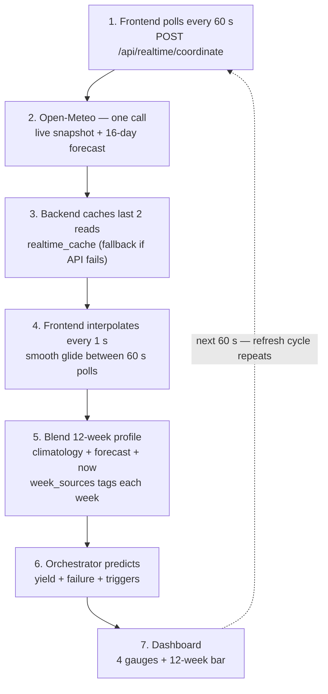

# Slide 7 — Implementation & Coding

> The twin ships as a **FastAPI service + React dashboard**. This slide zooms into the **live Real-Time Monitor** path — how data is fetched, refreshed every 60 s, interpolated between polls, and turned into a prediction.

## Implementation stack (brief)

- **Backend:** FastAPI, ~20 endpoints; `run_orchestrator` → `DAGOrchestrator` (5 model nodes).
- **Models:** PyTorch `LSTMAttention` + XGBoost + Ridge meta-learner (`predict.py`).
- **Frontend:** React 19 + Vite — `RealTimeMonitor`, `OdishaGISMap`, `DSSChat`, `SimulatorPage`.
- **Data:** NASA POWER (history / climatology) + Open-Meteo (live) — both reduced to **4 variables × 12 weeks**.

## Real-Time Monitor — how it actually happens

- **Poll:** frontend → `POST /api/realtime/coordinate` every **60 s** (`POLL_INTERVAL = 60000`).
- **Fetch:** one Open-Meteo call → current snapshot + 16-day forecast.
- **Interpolate:** frontend 1 s ticker linearly blends previous→latest poll (`progress = elapsed/60 s`) → smooth gauges. Backend `realtime_cache` interpolates a fallback if Open-Meteo fails (`is_mocked`).
- **Blend:** 20-yr climatology + `forecast` weeks + `now` at `current_week`; `week_sources[12]` tags each week.
- **Predict:** blended 12-week profile → `run_orchestrator(full_diagnosis)` → yield + failure + triggers.
- **Render:** 4 gauges (Temp/Humidity/Precip/Soil) + live telemetry & prediction streams + triggers; `is_mocked` flags fallback.

**Code anchors:** backend `main.py` — `realtime_cache` (L591) · `/api/realtime/coordinate` (L659) · `_interpolate_snapshot` (L612, linear for T2M/RH2M/GWETROOT, hold-last for PRECTOTCORR) · `_get_climatology` (L593) · `_aggregate_hourly_to_weekly` (L624); frontend `RealTimeMonitor.jsx` — `POLL_INTERVAL = 60000` (L7) · 1-second interpolation ticker `setInterval(tick, 1000)` (L218) · linear blend `t(a,b) = a + (b-a)*progress` (L160).

---

## Reference — External Weather APIs (API Working)

> The detailed algorithm write-ups for NASA POWER (Algorithm A) and Open-Meteo (Algorithm B) — the 4×12 schema, aggregation rules (SUM precip / MEAN temp-humidity-soil), `week_sources` provenance, and the fallback chain — go here. This replaces the old standalone `api-working.md`.
