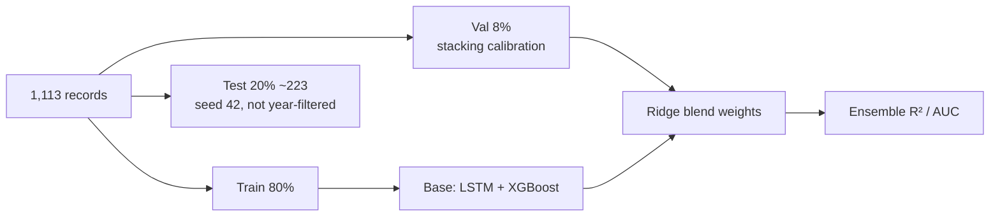

# Slide 8 — Testing & Validation

> Validate **statistically, probabilistically, functionally, and operationally** — not just demo. (The before-final PDF had no dedicated validation slide; this consolidates the model-metric slides, the "Mathematical Decision Rule" slide 18, and the implementation slide 21 into the required Slide 8.)

---

## Validation strategy
- **Random split, fixed seed 42** over **1,113 records** (30 districts × 2 seasons × 2006–2024): train 80% / validation 8% (calibration only) / **test 20% (~223 samples)**.
- Validation used **only to calibrate stacking** (Ridge meta-learner); final metrics reported on the **held-out test partition** (random, not year-filtered).
- Deliberately **not chronological** → avoids leakage from the post-2020 yield-regime shift.

---

## Model performance (held-out test, measured)

> Metrics re-measured on the saved model weights via `evaluate_metrics.py` over the deterministic
> seed-42 held-out test partition (n = 223, ~28% failure base rate).

| Metric | LSTM (84-step) | XGBoost (23 feat) | **Stacked Ensemble** |
|---|---|---|---|
| **Yield R²** | 0.641 | 0.682 | **0.712** |
| **Yield RMSE (Q/A)** | 4.05 | 3.81 | **3.63** |
| **Failure AUC** | 0.685 | 0.663 | **0.721** |
| **Failure F1 @0.5** | 0.400 | 0.425 | **0.455** |

- *Scale reference:* Yield RMSE ∈ **[0 perfect, 6.75 naive-mean baseline, 39.15 theoretical max]** Q/A; R², AUC, F1 ∈ **[0, 1]** (0.5 = random for AUC). The Stacked RMSE (3.63) is ~54% of the naive baseline.
- Stacking blend searched on a **chronological validation window (2018–2019)**, never on the test set:
  Yield = `0.2·LSTM + 0.8·XGBoost` ; Failure = `0.68·LSTM + 0.32·XGBoost`.
- Stacked **beats both base learners on every metric** (highest R², lowest RMSE, highest AUC & F1).

---

## Uncertainty — Monte Carlo Dropout
- 500 stochastic forward passes with **dropout kept ON** at inference → 90% confidence interval + distribution.
- Example: `Yield 14.2 ± 1.9 Q/Acre`, `90% CI [12.1, 16.3]` — a range, not a single number.

---

## Functional validation — 8 agronomic scenarios
`Normal · Drought · Flood/Cyclone · Thermal Sterility · Pest/Pathogen · Excellent · Rabi · Coastal` — each asserts (a) yield in expected band, (b) failure-risk direction, (c) the correct biophysical trigger fires.

| Trigger | Validated rule |
|---|---|
| **Drought Stress** | ≥ 3 consecutive low soil-moisture weeks (W3–8) |
| **Submergence Flooding** | ≥ 1 week PRECTOTCORR > 250 mm |
| **Thermal Sterility** | T2M > 34 °C in ≥ 1 week (grain filling) |
| **Pest/Pathogen Risk** | ≥ 2 consecutive warm-humid weeks (RH > 85%) |

---

## Robustness & operational governance
- **Cross-district consistency:** identical weather → distinct district yields (district effect present).
- **Directional stress:** increasing drought severity → monotonically decreasing yield (physics-aligned).
- **Cold-start safety:** unknown district raises `ValueError` (no silent wrong default).
- **Input sanitization:** out-of-range telemetry rejected (negative precip, T outside −50…60 °C).
- **Metric-gated deploy** (PDF slide 18 "Mathematical Decision Rule"): deploy new model only if
  `R²_new ≥ R²_old − 0.02 AND AUC_new ≥ AUC_old − 0.02`; else **safe fallback** (zero-downtime). The twin never silently regresses.

---

### Speaker notes
- "Validation is layered: statistical (R²/AUC), probabilistic (MC Dropout CI), functional (8 agronomic scenarios), and operational (metric-gated deploy)."
- "We avoided a chronological split on purpose — otherwise the model memorises the post-COVID yield jump and fails to generalize."
- "The 4 triggers aren't a black box; each is a checkable physical rule, validated against known stress scenarios."
- "The metric-gated deploy rule (from the PDF's Mathematical Decision Rule slide) guarantees every update is validated before it goes live."
