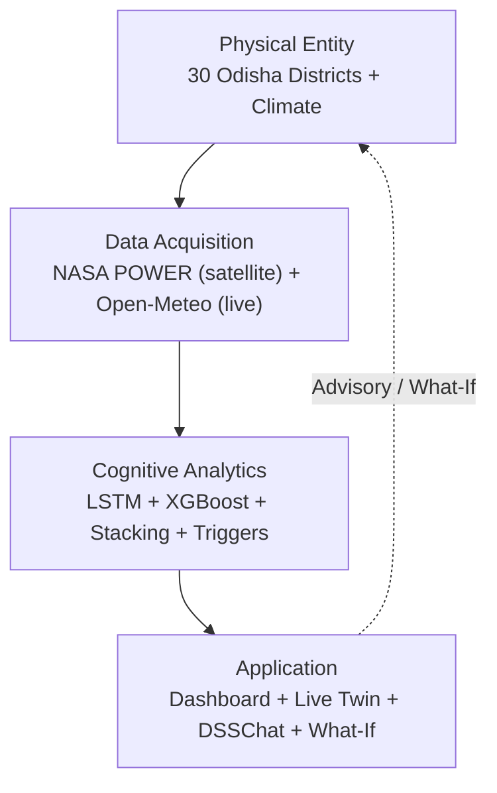

# Slide 9 — Results & Discussion

> **Goal of this slide:** show what the twin actually *produces* and interpret what it means. This is the **outcomes** slide — the metric table and test cases already live in `slide-08-testing-validation.md` (how we validated), and the data sources in `slide-07-implementation-and-coding.md` (API Working section). Do **not** re-table the validation metrics here; discuss them.

---

## 9.0 Cognitive Digital Twin — not just an ML model

The deliverable is a **working Cognitive Digital Twin** of Odisha's rice system. The ML ensemble is the *cognitive layer* inside it — not the whole system. A digital twin is a continuously-synchronised virtual counterpart of a physical entity; here it mirrors 30 districts × 2 seasons and stays in step with the field through **satellite remote sensing**.

**What makes it a twin (not just a model):**

1. **Mirrors the physical entity** — 30 districts × 2 seasons exist as live digital counterparts.
2. **Remote-sensing assimilation, no ground sensors** — NASA POWER (20-year satellite climatology + historical) and Open-Meteo (live current + 16-day forecast) are both satellite/reanalysis feeds; the twin needs no local weather stations.
3. **State across time** — the Real-Time Monitor updates the twin as weather evolves (live snapshot + climatology blend + interpolation).
4. **Cognitive & explainable** — LSTM attention → 4 biophysical triggers; Groq LLM turns predictions into plain-English advisory.
5. **Acts back on the physical world** — What-If simulation and advisory close the loop to the farmer/agronomist.



---

## 9.1 Results at a Glance (outcomes, not validation)

**Cognitive layer accuracy (held-out test, measured — full table in slide-08):**
Stacked ensemble achieves **Yield R² 0.712**, **Yield RMSE 3.63 Q/A**, **Failure AUC 0.721**, **Failure F1 0.455 @0.5** — and **beats both base learners on every metric**.

**Coverage & scale:**
- **30 districts × 2 seasons** (Kharif + Rabi), **2006–2024**.
- **1,113 harmonized records**, **0 interpolated** rows.
- **Dual-track delivered:** one pipeline predicts continuous yield **and** classifies binary failure anomaly.
- Random Forest was benchmarked and **dropped** (Yield R² 0.62 < XGBoost 0.682) — final ensemble is XGBoost + LSTM + Ridge stacking.

**Worked example — what the twin actually returns:**
> *Ganjam / Kharif / 2024* → **predicted yield 9.4 Q/Acre**, **failure probability 0.18 (LOW)**, **no active triggers**. A plain, actionable district-season diagnosis — the kind of output the dashboard renders for every selection.

> These numbers are the accuracy of the twin's *cognitive layer*. The twin's real value is the **integration** around them — live remote-sensing assimilation, state, explainability, and actuation.

---

## 9.2 What the Results Show

- The **Stacked ensemble beats both base models on every metric** (highest R², lowest RMSE, highest AUC & F1).
- Blend weights reveal where each model adds value:
  - **Yield** = `0.2·LSTM + 0.8·XGBoost` → point-in-time tabular features dominate yield.
  - **Failure** = `0.68·LSTM + 0.32·XGBoost` → temporal patterns (LSTM) dominate failure detection.

```mermaid
flowchart LR
    A[1,113 records\n30 districts x 2 seasons] --> B[Stacked Ensemble\n(cognitive layer)]
    B --> C["Yield R2 0.712"]
    B --> D["Failure AUC 0.721"]
    C --> E[Dual-track:\nregression + binary failure]
    D --> E
    E --> F[Cognitive Digital Twin\n(live + explainable + acts back)]
```

---

## 9.3 Discussion — Mapped to the 4 Research Gaps (twin capabilities)

| Research Gap | Result = a Digital-Twin Capability |
|---|---|
| **Labeling Gap** (yield volume only) | Twin classifies **binary failure** via Q₁ thresholds — **Failure AUC 0.721** — not just a yield number. |
| **Explainability Gap** (black-box DL) | LSTM attention → **4 biophysical triggers**; e.g., the drought scenario fires **Drought Stress** (≥3 low soil-moisture weeks in W3–8). The twin *explains itself*. |
| **Macro→Micro Gap** (no field sensors) | Twin assimilates **satellite remote sensing** and resolves any pinned coordinate via boundary point-in-polygon → **field-level district risk** with zero ground stations. |
| **Real-Time Gap** (batch only) | Twin stays in sync via **live Open-Meteo** current + 16-day forecast, not a one-off batch prediction (see `slide-07-implementation-and-coding.md`, API Working section). |

---

## 9.4 Evidence — Live Digital-Twin Dashboard


*The deployed dashboard is the digital-twin decision view: per district/season it shows predicted yield, failure probability, attention-weighted drivers, and the active biophysical triggers — the virtual counterpart rendered for a human operator.*


*Optional result figures to add: (a) predicted-vs-actual yield scatter on the test set, (b) weekly attention heatmap showing the model's peak focus on W4–6, (c) district failure-probability choropleth for a chosen season.*

---

## 9.5 Uncertainty & Trust

- **Monte Carlo Dropout** gives a confidence range, not a single number:
  > *"9.4 Q/Acre, but likely between 7.6 and 11.2."*
- 500 stochastic forward passes (dropout ON at inference) → 90% CI + full distribution.
- No separate probabilistic model needed — uncertainty is principled and cheap, so the twin's operator knows *how sure* it is.

---

## 9.6 Limitations (honest discussion)

- **Failure F1 below design target:** measured F1 is 0.455 @0.5 (0.538 @ optimal threshold) — under the NFR-07 target of 0.70. Failure risk should be read together with the probability *and* the triggers, not as a hard label.
- **Models predate the latest dataset:** the saved weights were trained on an earlier data version; re-measurement on the current 2006–2025 data gives the figures shown. A retraining pass is recommended before deployment.
- **Post-2020 yield regime shift:** mean yield doubled (7.8 → 14.0 Q/Acre). Models trained on the historical distribution **under-predict recent highs**. Mitigated by the retraining pipeline + metric-gated deployment (the twin never silently regresses).
- **Rabi sparsity:** the Nov–Jan window has fewer samples and some districts don't cultivate Rabi rice → weaker Rabi validation coverage.
- **i.i.d. split:** the random split treats years as independent; temporal drift is handled **operationally** (deploy governance), not by the split itself.

---

## 9.7 Practical Impact ("So What")

- A **continuously-synchronised digital twin** — not a one-shot ML prediction — that watches Odisha's rice system in near-real-time via satellite remote sensing.
- **Early failure warning** for agronomists before yield is locked in.
- **What-If planning** — test drought/flood/heat scenarios and see yield + risk shift.
- **Plain-English advisory** via Groq LLM, grounded in the actual prediction + triggers.
- Bridges passive government yield statistics and **proactive, predictive disaster management**.

---

### Speaker notes (key talking points)
- "We did **not** just train an ML model — we built a **cognitive digital twin** that runs on satellite remote sensing (NASA POWER + Open-Meteo) and stays in sync with the field in real time."
- "The models are one layer inside the twin — the cognitive layer. The twin also assimilates live remote sensing, holds state, explains itself through triggers, and acts back through What-If and advisory."
- "Measured on the held-out test set, the Stacked ensemble reaches Yield R² 0.712 and Failure AUC 0.721 — and it beats both base models on every metric. The full table is on the validation slide."
- "We're honest about the limits: failure F1 is moderate and the models predate the latest data — that's exactly why the retraining + metric-gated deploy exists, so the twin keeps absorbing new data instead of going stale."
- "Cross-reference: validation method + metrics in `slide-08-testing-validation.md`; data sources in `slide-07-implementation-and-coding.md` (API Working section)."
