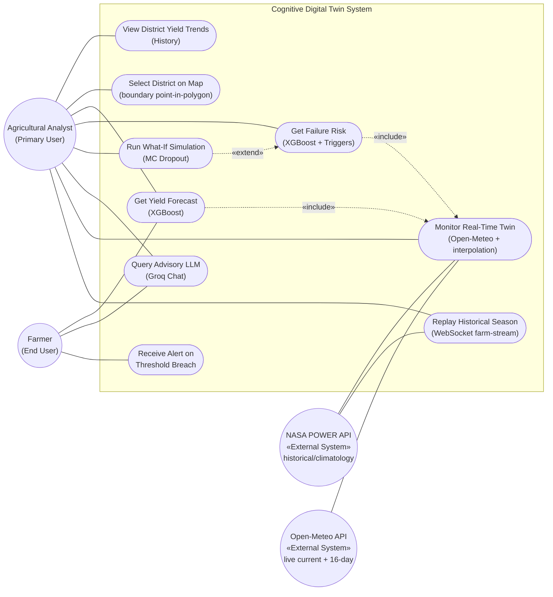
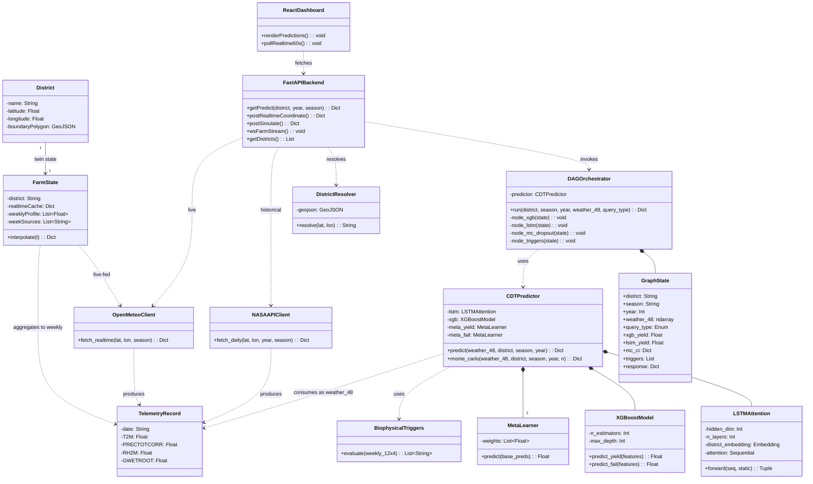
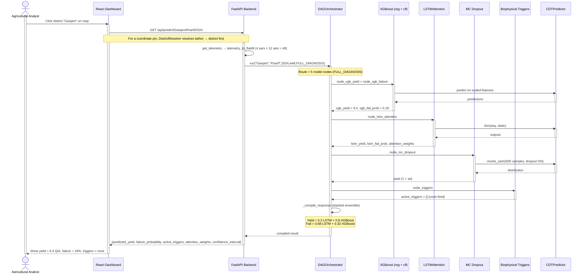
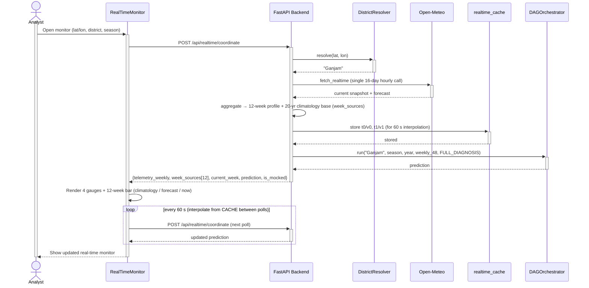
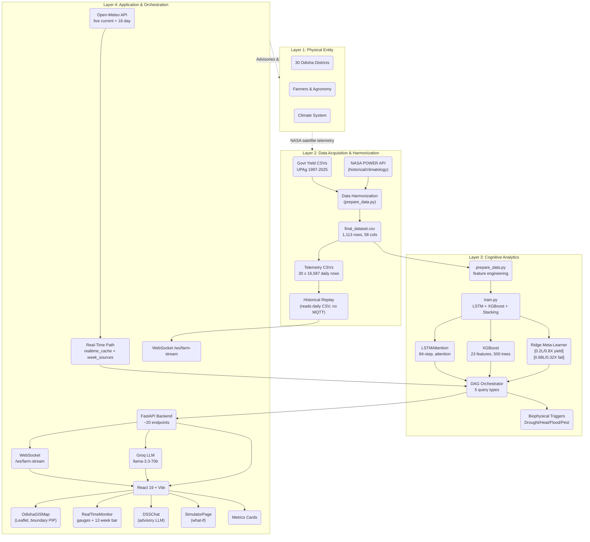

# UML Diagrams — Cognitive Digital Twin (Updated v4)

> **Updated from `presentation-2/UML_Diagrams_Detailed.md` (v3).** The v3 diagrams contained *planned/aspirational* elements that do not match the built system — notably a **MQTT message broker** + **VirtualSensor** publisher, and a **Govt API** sync that was never implemented. This v4 revision aligns every diagram with the **actual implementation** verified in the codebase:
> - Historical weather comes from **NASA POWER** (`fetch_nasa_power_telemetry`, Algorithm A); live weather comes from **Open-Meteo** (`/api/realtime/coordinate`, Algorithm B) — both reduced to the same **4 variables × 12 weeks** schema. No MQTT / VirtualSensor is used (historical replay reads the 30 daily CSVs directly; AGENTS.md rule #11: "No MQTT").
> - District selection resolves a pinned coordinate via **boundary point-in-polygon** (`find_district_by_boundary` over `odisha_districts.geojson`); outside the state → `"Unknown"` (no silent default).
> - Live interpolation uses **`realtime_cache`** (t0/v0, t1/v1) between 60 s polls; `week_sources[12]` tags each week `climatology` / `forecast` / `now`.
> - Backend = **FastAPI, ~20 endpoints** + WebSocket `/ws/farm-stream`; orchestrator routes **5 query types → 5 model nodes**.
> - Measured metrics (not the old AGENTS.md figures) are used in examples.

---

## 1. Use Case Diagram (v4)

**Use Case Descriptions**

| UC ID | Name | Primary Actor | Trigger | Result |
|-------|------|--------------|---------|--------|
| UC-01 | View District Yield Trends | Analyst | Select district + season | Historical yield chart with Q1 overlay |
| UC-02 | Select District on Map | Analyst | Click map → point-in-polygon resolve | District name (or "Unknown" if outside Odisha) |
| UC-03 | Get Yield Forecast | Analyst / Farmer | Click district on map | Predicted yield (Q/Acre) |
| UC-04 | Get Failure Risk | Analyst | Request risk assessment | Failure probability + biophysical triggers |
| UC-05 | Run What-If Simulation | Analyst | Adjust climate sliders | Counterfactual yield + risk comparison |
| UC-06 | Query Advisory LLM | Analyst / Farmer | Type natural-language question | Expert advisory (Groq) |
| UC-07 | Monitor Real-Time Twin | Analyst | Open Real-Time Monitor | Live telemetry + prediction (60 s poll, interpolated) |
| UC-08 | Replay Historical Season | Analyst | Start stream (district/year/season/speed) | Replay from 30 daily CSVs via WebSocket |
| UC-09 | Receive Alert | Farmer | Failure probability > threshold | In-app / chat notification |

---

## 2. Class Diagram (v4)

---

## 3. Sequence Diagram — Predict Crop Failure via DAG (v4)

**Flow:** Analyst clicks a district → Frontend calls API → DAG routes to model nodes → Compiled (stacked) response → Dashboard renders. Shows the `FULL_DIAGNOSIS` route (all 5 nodes). For a coordinate pin, `DistrictResolver` runs first.

---

## 4. Sequence Diagram — Real-Time Monitor via Open-Meteo (v4, bonus)

**Flow:** Frontend opens Real-Time Monitor → polls `/api/realtime/coordinate` every 60 s → Open-Meteo single call → `realtime_cache` interpolation → climatology base overlaid with forecast/`now` (`week_sources`) → orchestrator `full_diagnosis` → live prediction.

---

## 5. Architecture Diagram (v4 — 4-Layer, no MQTT)

---

## 6. What changed vs presentation-2 (v3)

| Element | v3 (presentation-2) | v4 (this file, actual build) |
|---|---|---|
| Live data transport | MQTT **Message Broker** + **VirtualSensor** publisher | **Open-Meteo** API + `realtime_cache` interpolation (no MQTT; AGENTS rule #11) |
| Historical replay | VirtualSensor → broker → subscriber | Reads 30 daily CSVs directly → WebSocket `/ws/farm-stream` |
| External systems | NASA POWER + (Govt API planned, not built) | NASA POWER (historical) + **Open-Meteo** (live); both → 4×12 schema |
| District selection | Map click (implicit) | Map click → **boundary point-in-polygon** (`DistrictResolver`); outside → "Unknown" |
| Backend | "17 endpoints" | **~20 endpoints** (incl. `/api/realtime/coordinate`, `/api/predict/coordinate`, stream control) |
| LSTM params | `max_depth` implied 6 | `max_depth 4` (actual `train.py`); embedding 30→8, dropout 0.2 |
| XGBoost | standalone | XGBoost + **Ridge stacking meta-learner** (weights 0.2/0.8, 0.68/0.32) |
| Metrics in examples | AGENTS.md (0.736/0.814) | **Measured** (R² 0.712, RMSE 3.63, AUC 0.721, F1 0.455@0.5) |
