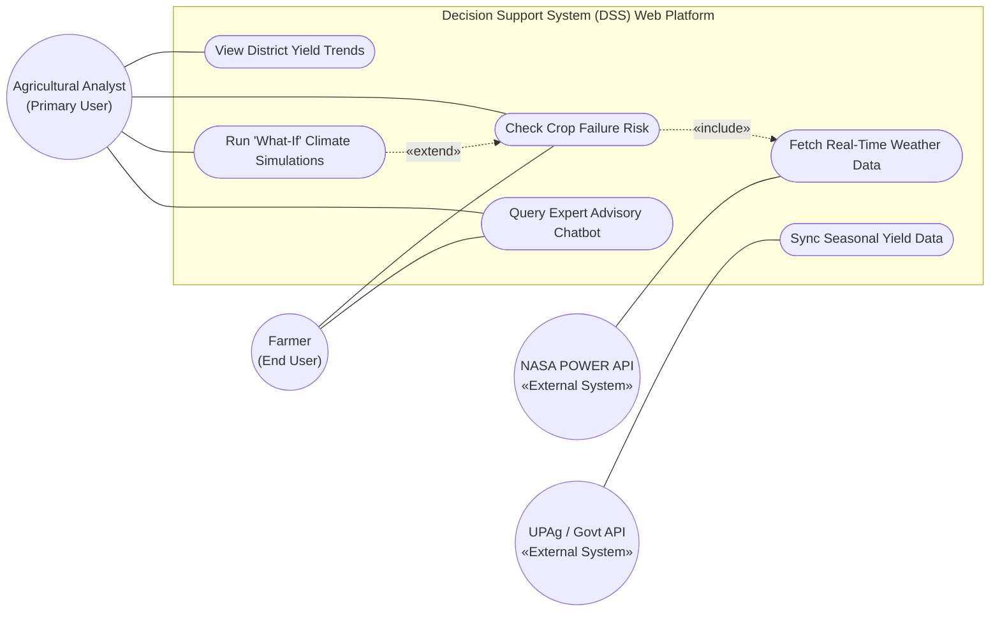
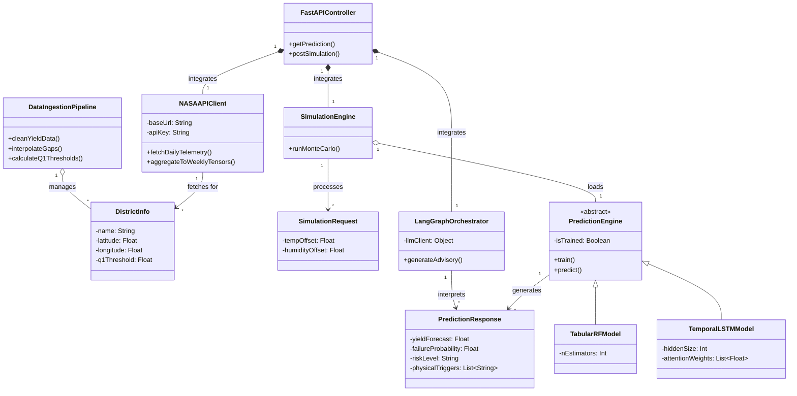
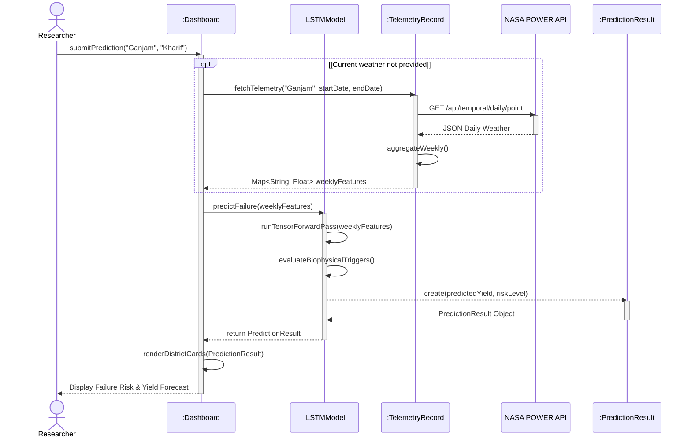
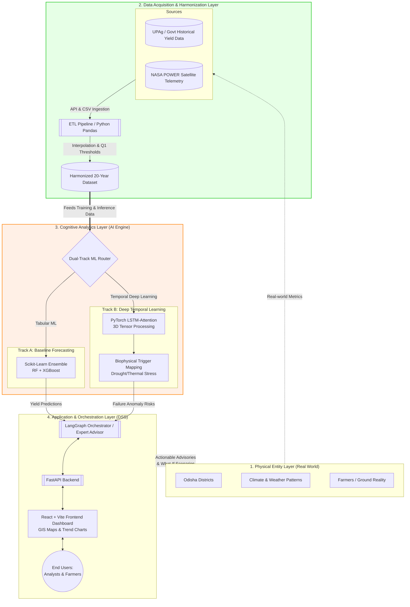

# UML Diagrams for Cognitive Digital Twin (CDT)

These UML diagrams define the architecture of the Crop Failure Prediction System using strict Object-Oriented Analysis and Design (OOAD) principles. The design derives from Abbott's Noun-Verb Analysis and aligns completely with the project's Functional Requirements.

---

## 1. Use Case Diagram (Functional View)

This diagram visualizes the system's external actors, the system boundary, and the nine primary functional requirements identified as Use Cases. It employs standard `«include»` relationships to show mandatory sub-processes.

---

## 2. Class Diagram (Structural View)

Generated directly from **Abbott's Noun-Verb Analysis**, this diagram details the candidate classes, their private (`-`) attributes, public (`+`) methods, and structural relationships (Composition, Aggregation, Inheritance, and Dependency).

---

## 3. Sequence Diagram (Behavioral View)

This diagram tracks the chronological flow and lifecycle of the **Predict Crop Failure** (UC7) operation. It utilizes lifelines, activation execution boxes, synchronous calls (solid arrows), return messages (dashed arrows), and an `alt/opt` interaction frame.

---

## 4. System Architecture Diagram

This diagram outlines the 4-layer Cognitive Digital Twin architecture, mapping the real-world agricultural context through data acquisition, AI analytics, and finally to the user-facing Decision Support System (DSS).

