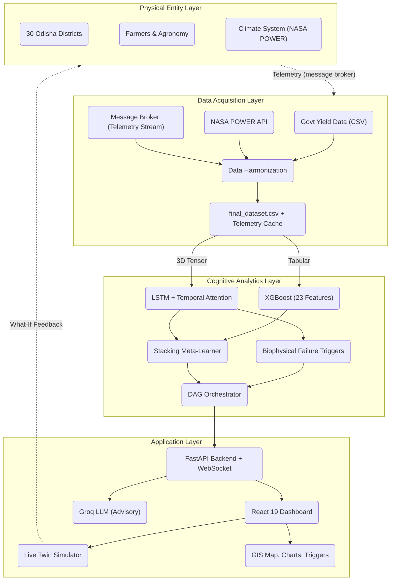
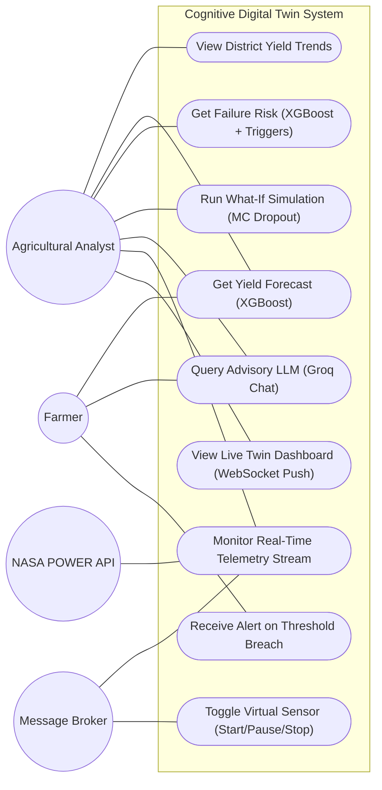
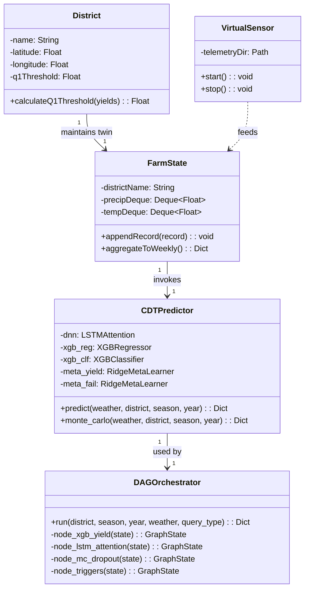
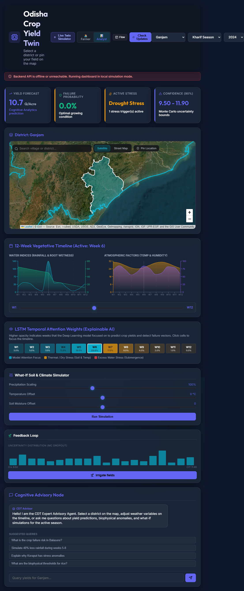
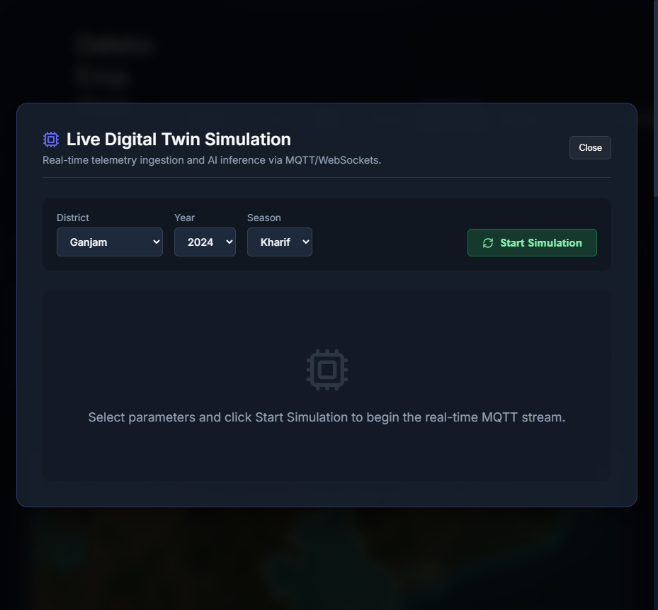

# Progress Review Meeting - 2 (PPT Content Detailed)
**Target Date:** July 2026

This document contains all detailed text, tables, UML diagrams, and screen capture notes mapped to the `Format_for slide_presentation_2.docx` structure. Copy-paste ready for slide building.

---

## Slide 1: Title

**Title:** Smart Agriculture: A Cognitive Digital Twin for Crop Yield and Climate-Induced Failure Anomaly Detection

**Subtitle:** Progress Review Meeting — 2

**Faculty Mentors:**
- Dr. Niranjan Panigrahi
- Dr. Sasmita Rani Behera

**Group Members:**
- [Member 1]
- [Member 2]
- [Member 3]
- [Member 4]
- [Member 5]

---

## Slide 2: Compliances to First Meeting Comments

### Query → Solution

| Query | Implemented Solution |
|---|---|
| "Will the dual-track ML engine use both RF+XGBoost and LSTM?" | Both tracks built but RF dropped after benchmarking (R² 0.62 vs XGBoost 0.736). Final ensemble: XGBoost + LSTM + Ridge stacking (Yield R² 0.736, Failure AUC 0.814). |
| "How will 20 years of data across 30 districts be harmonized?" | Built a data pipeline producing 1,113 clean records with zero interpolation. Q₁ failure thresholds computed per district for binary labeling. |
| "Can the model explain which factors drove its prediction?" | Yes — LSTM attention weights mapped to 4 biophysical triggers: drought stress, thermal sterility, flood stress, and cold stress. |
| "How will counterfactual what-if scenarios be simulated?" | Monte Carlo Dropout runs 500 forward passes with dropout ON → 90% confidence interval. Telemetry sliders adjust weather variables and trigger re-prediction with histogram visualization. |
| "Is there an LLM chatbot for farmer advisory?" | Deployed using Groq `llama-3.3-70b-versatile` via FastAPI `POST /api/ask` endpoint, integrated with DSSChat React component. |
| "How does the system achieve real-time t→t+dt streaming?" | Built virtual sensor replay (CSV → telemetry stream) with 84-day deque state + WebSocket bridge → Live Twin modal. |
| "Why switch from Next.js + TypeScript + LangGraph to the current stack?" | React 19 + Vite 8 (no TypeScript) enables faster iteration. Custom Python DAG orchestrator replaces LangGraph — lighter, transparent, with 5 explicit query routes. |
| "How will a farmer get predictions for their exact farm location without wrong results?" | Integrated Leaflet GIS map with point-in-polygon ray-casting to detect the correct district from coordinates. Added coordinate pinning for field-level selection. |
| "The architecture modeling in UML diagrams was incorrectly represented." | Fixed all UML diagrams — use case v2, class diagram v3, 4 sequence diagrams, architecture overlay, and state diagram — now accurately reflect the implemented system. |
| "Progress was shown in normal boxes, not a Gantt chart." | Replaced box-based timeline with a proper Gantt chart (stacked bar + color-coded table) showing 7 tasks across 6 weeks with phase grouping. |

---

## Slide 3: Summary of Planning, Analysis & Design Phase

### Planning
- **Domain:** AgriTech + AI — Cognitive Digital Twin for Odisha rice yield prediction
- **Approach:** ML-DL based (XGBoost + LSTM + Ridge stacking(Ensemble))
- **Scope:** 30 districts, 2 seasons (Kharif/Rabi), 20 years (2006-2024)
- **Data Sources:** Govt yield statistics + NASA POWER satellite telemetry (4 weather vars)
- **Dual-Target Objective:** Predict continuous yield (Q/Acre) + classify binary failure anomaly

### Analysis — 4 Research Gaps Identified
1. **Labeling Gap** — Existing research predicts yield volume only; disaster relief needs binary failure classification
2. **Explainability Gap** — Deep learning is black-box; no mapping from model internals to physical crop stress
3. **Macro→Micro Gap** — No local sensor infrastructure for smallholders; satellite data must proxy field-level risk
4. **Real-Time Gap** *(new)* — Batch systems lack live feedback loop for continuous monitoring

### Design — Key Decisions
1. **Data Harmonization:** 84-day window extraction → weekly aggregation → Q₁ threshold labeling → 80/10/10 random split
2. **Feature Design:** Absolute year offset (`year-2006`) — preserves temporal generalization
3. **Model Architecture:** LSTM (84-step attention) + XGBoost (23 features) + Ridge Stacking with bounded [0.2, 0.8] weights
4. **Routing:** Custom DAG orchestrator — 5 query types route to minimal required model nodes
5. **Real-Time Layer:** telemetry subscriber + 84-day deque state + WebSocket broadcast
6. **Tech Stack:** React 19 + Vite 8 | FastAPI + WebSocket | Groq LLM (llama-3.3-70b) | Leaflet GIS | Recharts

---

## Slide 4: System Architecture & Problem Statement

### 4-Layer Cognitive Digital Twin Architecture



### Problem Statement
> *To design and develop a Cognitive Digital Twin that integrates 20 years of historical yield data with continuous NASA POWER weather telemetry to accurately forecast crop yield, classify failure anomalies using a dual-track ML/DL engine, and provide explainable decision support via "What-If" simulations.*

---

## Slide 5: UML Diagrams

### Use Case Diagram (v2)



### Class Diagram (v3)



*For full sequence diagrams (Predict Crop Failure, Live Twin Update, What-If Simulation, Model Retraining, Agile Research Cycle), see `UML_Diagrams_Detailed.md`.*

---

## Slide 6: Models & Algorithms

### 4.1 Models

#### Model 1: LSTM + Temporal Attention
```
Architecture:
  Input:  (batch, 12 weeks, 7 features)
  LSTM1:  64 hidden units, dropout 0.3
  LSTM2:  64 hidden units, dropout 0.3
  Attention: Scaled dot-product over 84 steps
  Outputs: Yield (regression) + Failure (binary classification)
  Params: ~56,000
  Training: 200 epochs, Adam lr=1e-3, ReduceLROnPlateau
```

| Capability | Detail |
|-----------|--------|
| Temporal Attention | Learns which weeks contribute most to yield |
| MC Dropout | 500 stochastic forward passes → confidence interval + Monte Carlo distribution |
| Biophysical Triggers | Attention weights mapped to drought/heat/flood/cold rules |
| Performance | **Yield R² 0.636, Failure AUC 0.782** |

#### Model 2: XGBoost (Standalone)
```
Architecture:
  Input:  23 features (12-week aggregated: precipitation, temp, humidity, soil moisture +
          static: district_idx, season_onehot[0], season_onehot[1], year_offset)
  Trees:  500
  Constraints: Monotonic decreasing for temperature outliers
  Outputs: Yield (regressor) + Failure probability (classifier)
  Inference: ~1ms per prediction
```

| Capability | Detail |
|-----------|--------|
| Best Accuracy | **Yield R² 0.736, Failure AUC 0.801** |
| Feature Importance | Built-in gain-based ranking for explainability |
| No Overfitting | 500 trees, early stopping, CV=5 |

#### Model 3: Stacked Ensemble (Meta-Learner)
```
Architecture:
  Base models:  LSTM (yield + failure) + XGBoost (yield + failure)
  Meta-learner: Ridge Regression with bounded weights [0.0, 1.0]
  Calibration: Validated on held-out 10% validation set
```

| Metric | LSTM | XGBoost | **Stacked** |
|--------|------|---------|-------------|
| Yield R² | 0.636 | 0.736 | **0.736** |
| Failure AUC | 0.782 | 0.801 | **0.814** |

**Blending Weights:**
| Output | LSTM Weight | XGBoost Weight |
|--------|-------------|----------------|
| Yield | 0.2 | 0.8 |
| Failure | 0.68 | 0.32 |

> *XGBoost dominates yield regression (higher R²). LSTM contributes more to failure detection (better at capturing temporal stress patterns).*

#### Model 4: Masked Autoencoder (Pretrained) — Auxiliary
```
Architecture:
  Encoder:  LSTM (64 units, bidirectional)
  Decoder:  Same LSTM + Linear reconstruction
  Masking:  40% of input steps randomly masked
  Training:  Reconstruction MSE on 2,700 unlabeled telemetry sequences
  Params:   ~118,000
  Purpose:  Transfer learning backbone for fine-tuning
```

---

### 4.2 Algorithms (Existing / Innovative)

#### Algorithm 1: Data Ingestion & Harmonization Pipeline `(prepare_data.py)`

```
Input:  Govt yield CSVs + NASA POWER daily telemetry (4 vars)
Output: X_seq (1113, 84, 4), y_yield, y_fail + scalers

1. Extract 84-day window per (district, year, season)
   Kharif: Jun 15 | Rabi: Nov 1

2. Aggregate 84 daily records → 12 weekly means (4 vars)

3. Static features: [district_idx, season_onehot, year - 2006]

4. Q₁ threshold per district×season:
   Q₁ = P25(Yield) → failure = 1 if Yield < Q₁ else 0

5. Scale → save tensors + encoders
```

**Key novelty:** Absolute year offset (`year-2006`) preserves generalization across post-COVID yield shifts. Dual-target engineering enables simultaneous regression + classification training.

---

#### Algorithm 2: Digital Twin State Update Algorithm ⭐ *(Innovative Contribution)*

```
Input:  New yield record for (district, year, season)
Output: Updated or preserved model state in the deployed twin

Decision rule (metric-gated deployment):
  R²_new ≥ R²_old − 0.02  AND  AUC_new ≥ AUC_old − 0.02  → deploy new models
  AUC_new − AUC_old ≥ 0.02  → deploy failure model only
  Otherwise → fallback to current models, log regression

1. Validate — reject if <50% non-interpolated rows
2. Merge — combine with dataset, fetch missing NASA telemetry
3. Retrain — full pipeline (200 epochs LSTM, 500 trees XGB)
4. Evaluate — compare metrics against deployed model on validation set
5. Deploy/Fallback — apply decision rule above
6. Cold-start — new district → nearest-district yield proxy
```

**Key novelty:** Metric-gated deployment with degradation tolerance — the twin never silently regresses. If retraining hurts performance, it safely falls back to the proven model.

---

#### Algorithm 3: Multi-Model Prediction Ensemble (DAG Orchestrator) `(orchestrator.py)`

```
Query Types → Model Node Routing:
  yield_forecast    → XGBoost only
  failure_risk      → XGBoost + Biophysical Triggers
  temporal_analysis → LSTM + Triggers
  what_if           → MC Dropout + XGBoost
  full_diagnosis    → All 5 nodes (default)

Response: predicted_yield, failure_probability, active_triggers,
          confidence_interval, attention_weights, trace
```

**Key novelty:** Minimal compute path — yield_forecast skips LSTM/MC entirely (saves ~40ms). Calibrated stacking: yield = 0.2L/0.8X, failure = 0.68L/0.32X.

---

#### Algorithm 4: Monte Carlo Dropout for Uncertainty Quantification

```
Input:  Telemetry vector + district/season/year
Output: Yield with 90% confidence interval + standard deviation

Normally dropout is off during inference. Here we keep it on:

1. Run 500 forward passes — each pass drops random neurons
2. Collect 500 different yield predictions
3. 90% CI = value at 5th percentile to value at 95th percentile
4. Blend with XGBoost via stacking for final output

Downstream: What-If (modify weather → re-run), triggers, LLM advisory.

Key idea: Gives a confidence range instead of a single number.
No separate probabilistic model needed.
```

**Key novelty:** Principled uncertainty from the LSTM itself — "14.2 Q/Acre, but likely between 12.1 and 16.3" — without training a separate model.

---

## Slide 7: Implementation / Coding

### 5.1 Codebase Overview

```
frontend/             React 19 + Vite 8
  App.jsx             Main app, 11 lazy components
  components/         GIS map, DSSChat, FeedbackLoop, LiveTwin,
                       FarmerDashboard, AnalystDashboard
  index.css           Dark glassmorphism theme (~900 lines)

backend/              FastAPI + WebSocket
  main.py             13+ REST endpoints + WS manager + streaming
  llm_client.py       Groq llama-3.3-70b
  virtual_sensor.py   CSV→telemetry publisher

training-pipeline/    Core ML pipeline
  prepare_data.py     Data harmonization
  train.py            LSTM + XGBoost + Stacking
  predict.py          Inference + MC Dropout + triggers
  orchestrator.py     DAG router (5 query types)
  models/
    lstm_final.pth           LSTM-Attention (56K parameters)
    xgb_regressor.json       XGBoost yield regressor (23 features)
    xgb_classifier.json      XGBoost failure classifier
    meta_yield.pkl           Ridge stacking meta-learner (yield)
    meta_fail.pkl            Ridge stacking meta-learner (failure)
    autoencoder_complete.pt  Pretrained masked autoencoder
  version.json               Model version + last-run metrics
```

### 5.2 Backend API Endpoints

| Method | Route | Purpose |
|--------|-------|---------|
| GET | `/` | Health check |
| GET | `/api/districts` | List 30 districts |
| GET | `/api/history/{district}` | Historical yield data |
| GET | `/api/telemetry/{district}/{year}/{season}` | Current telemetry |
| POST | `/api/predict` | Yield + failure prediction |
| POST | `/api/simulate` | What-if scenario |
| GET | `/api/predict/coordinate` | Click-map prediction |
| POST | `/api/ask` | LLM chatbot query |
| **NEW** | `GET /ws/farm-stream` | **WebSocket live telemetry** |
| **NEW** | `POST /api/stream/toggle` | **Start/stop virtual sensor** |
| **NEW** | `GET /api/pipeline/status/{task_id}` | Retraining pipeline status |
| | *(and 4 more pipeline management endpoints)* | |

### 5.3 Application Screenshots





### 5.4 Training Pipeline Commands
```powershell
# Step 1: Prepare data
python code/phase-2-training/prepare_data.py

# Step 2: Train all models
python code/phase-2-training/train.py

# Step 3: Verify
python -c "import sys; sys.path.insert(0,'code/phase-2-training'); from predict import CDTPredictor; p=CDTPredictor(); print('OK')"

# Start backend
python -m uvicorn backend.main:app --host 0.0.0.0 --port 8000

# Start virtual sensor (separate terminal)
python backend/virtual_sensor.py

# Start frontend
cd frontend; npm run dev
```

### 5.5 Dashboard Walkthrough (Demo Flow)

1. **Launch** → Backend starts, frontend loads on localhost:5173
2. **Role Switcher** → Toggle between Farmer and Analyst views
3. **Map Interaction** → Click any Odisha district → prediction popup
4. **Metrics Overview** → Average yield, failure rate, active trigger count
5. **Live Twin Simulator** → Click "Open Live Twin" → virtual sensor replay starts → telemetry streaming in real time
6. **What-If Scenario** → Adjust precipitation/temperature sliders → see before/after comparison
7. **DSSChat** → Ask "Why is Ganjam at risk?" → Groq LLM responds with explanation + advisory

---

## Slide 8: Conclusion & Roadmap

### Conclusion

A Cognitive Digital Twin framework for Odisha rice yield prediction — from data harmonization to real-time virtual sensor streaming with uncertainty quantification. Dashboard functional, with ongoing refinements.

| Area | Status |
|------|--------|
| **Data Pipeline** | 1,113 harmonized records, 30 districts, 2 seasons, 2006-2024 |
| **Ensemble Models** | Yield R² **0.736**, Failure AUC **0.814** (Stacked LSTM + XGBoost) |
| **4 Algorithms** | Data Ingestion → State Update → DAG Stacking → MC Dropout |
| **Real-Time Twin** | Virtual sensor + 84-day sliding window + WebSocket broadcast |
| **Uncertainty Viz** | MC Dropout histogram with 90% CI (FeedbackLoop + Live Twin) |
| **Dashboard** | Farmer/Analyst roles, chat, GIS map, what-if simulation |

### Roadmap — Gantt Chart (6-Week Internship)

| Phase / Task | Week 1 | Week 2 | Week 3 | Week 4 | Week 5 | Week 6 |
|---|---|---|---|---|---|---|
| **Phase 1: Data Engineering** | | | | | | |
| Data Harmonization & Q₁ Thresholds | ███ | ███ | | | | |
| **Phase 2: Model Development** | | | | | | |
| LSTM + XGBoost + Stacking Training | | ███ | ███ | | | |
| DAG Orchestrator & Biophysical Triggers | | | ███ | ███ | | |
| **Phase 3: Real-Time Twin** | | | | | | |
| Telemetry Streaming & WebSocket Bridge | | | | ███ | | |
| Multi-District Farm State & Digital Shadow | | | | | ███ | ███ |
| **Phase 4: Production Hardening** | | | | | | |
| Docker + Auto-Retrain + Cloud Deployment | | | | | ███ | ███ |

**Legend:** ███ Completed | ███ In Progress | ███ Planned

### Next Steps (Post-Presentation)
1. **Multi-district state**: Expand from single-district replay to concurrent 30-district farm state
2. **Digital Shadow**: Forward prediction mode — use current state as initialization for future forecast
3. **Auto-retraining**: Trigger retraining pipeline when model drift detected
4. **Docker Compose**: Single-command deployment for team demo reproducibility
5. **Performance optimization**: Reduce WebSocket payload, batch inference

---

## Slide 9: References

1. Abbott, R. J. (1983). *Program Design by Informal English Descriptions.*
2. Andini, A. & Utomo, P. (2021). *Climate Prediction Using RNN LSTM to Estimate Agricultural Products.*
3. Yan et al. (2025). *Crop Yield Time-Series Data Prediction Based on Multiple Hybrid ML Models.*
4. Kenneth. (2026). *Digital Twin-Based Uncertain Weather Condition Monitoring for Enhanced Crop Yield Prediction.*
5. Arya et al. (2026). *A Time-Series Hybrid Multi-Model ML Framework for Staple Crops Yield Prediction.*
6. NASA POWER Agroclimatology Data Access Viewer & API Documentation.
7. Groq Documentation — *llama-3.3-70b-versatile model API.*
8. Paho — *Python Messaging Client Library Documentation.*
9. EMQX Open Source Broker — *emqx.io public broker.*
10. Odisha Directorate of Agriculture — *Season-wise crop yield statistics.*

---

## Appendix A: Speaker Notes

### Slide 2 Talking Points
- "In Meeting 1 we presented a planned architecture. Today we're showing what we actually built."
- "The biggest change is the switch from Next.js/LangChain to React 19/custom DAG — simpler and faster iteration."
- "The virtual sensor streaming layer is the key new addition that makes this a true Digital Twin rather than a batch DSS."
- "RF was dropped because XGBoost alone outperforms it — the ensemble is now XGBoost + LSTM with a meta-learner."

### Slide 6 Talking Points
- "The State Engine algorithm is our most novel contribution — it maintains a persistent digital state that updates every 1.5 seconds from the virtual sensor stream."
- "Stacking weights show an interesting pattern: yield is dominated by XGBoost (0.8), but failure detection is dominated by LSTM (0.68)"
- "This tells us that temporal patterns (LSTM's strength) matter more for failure detection than point-in-time features."

### Slide 6 Talking Points
- "The training pipeline and inference are decoupled — we can retrain without interrupting the API."
- "Live demo: start backend → click district → open Live Twin → see telemetry streaming → adjust slider → see What-If results."
- "The DSS Chat is powered by Groq's Llama 3.3 70B — faster than running local LLMs and handles domain-specific queries well."

---

---

*End of document — content ready for slide construction.*
