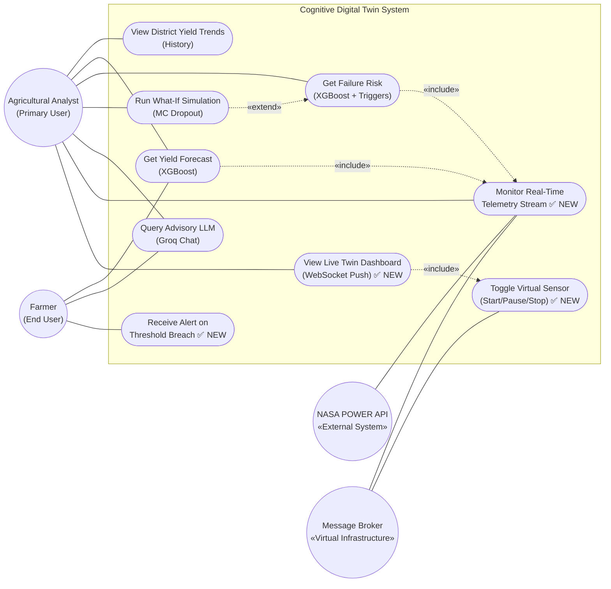
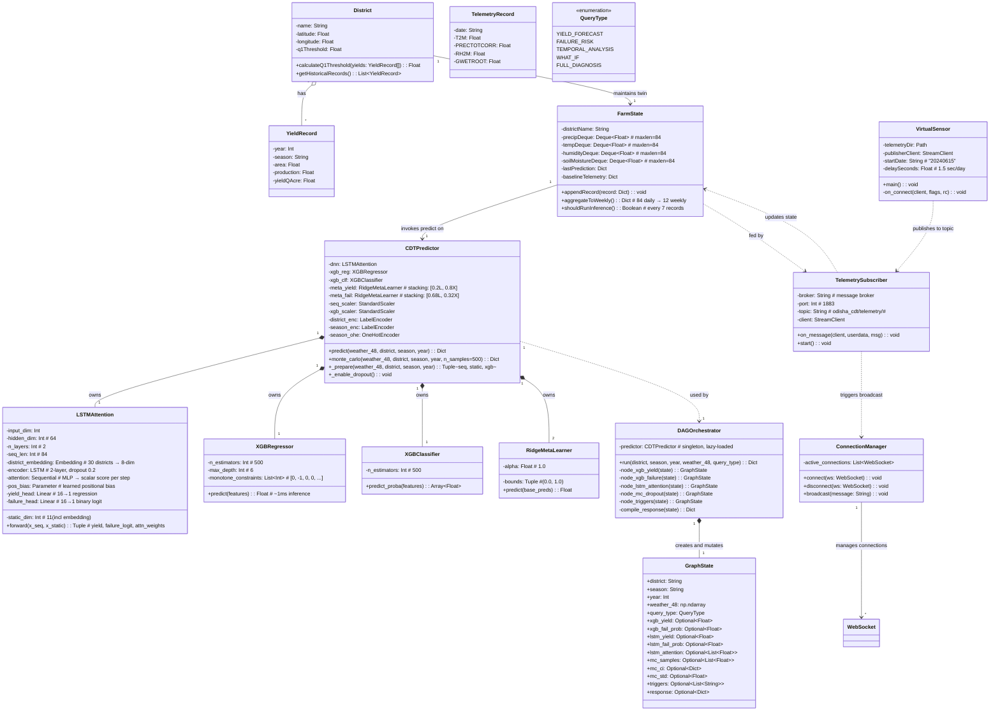
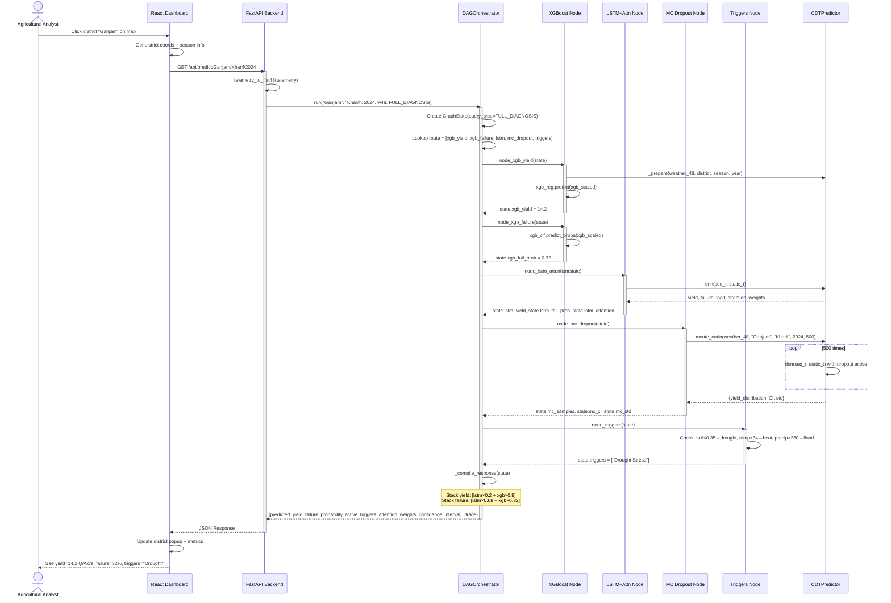
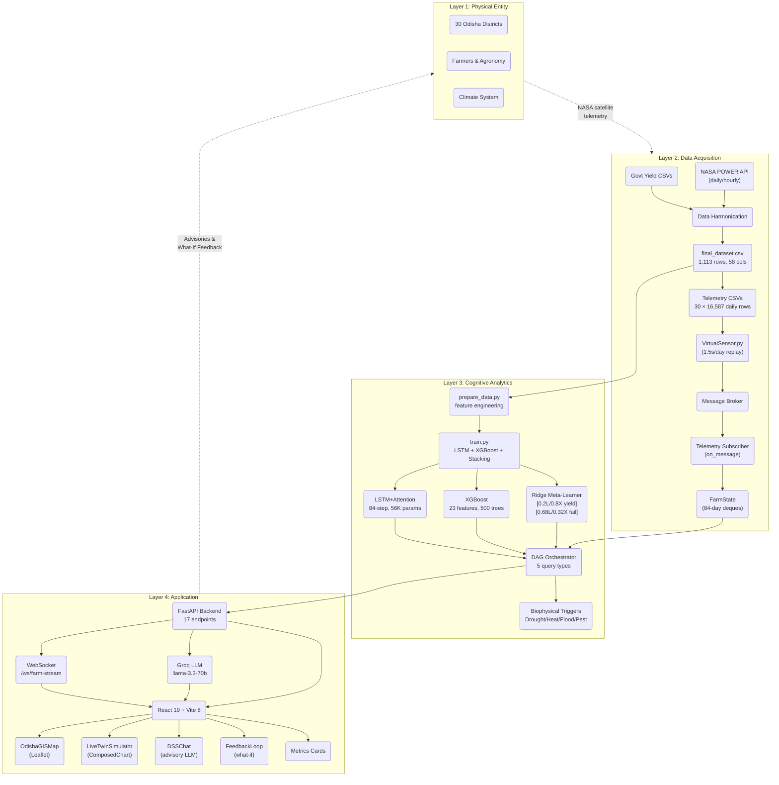
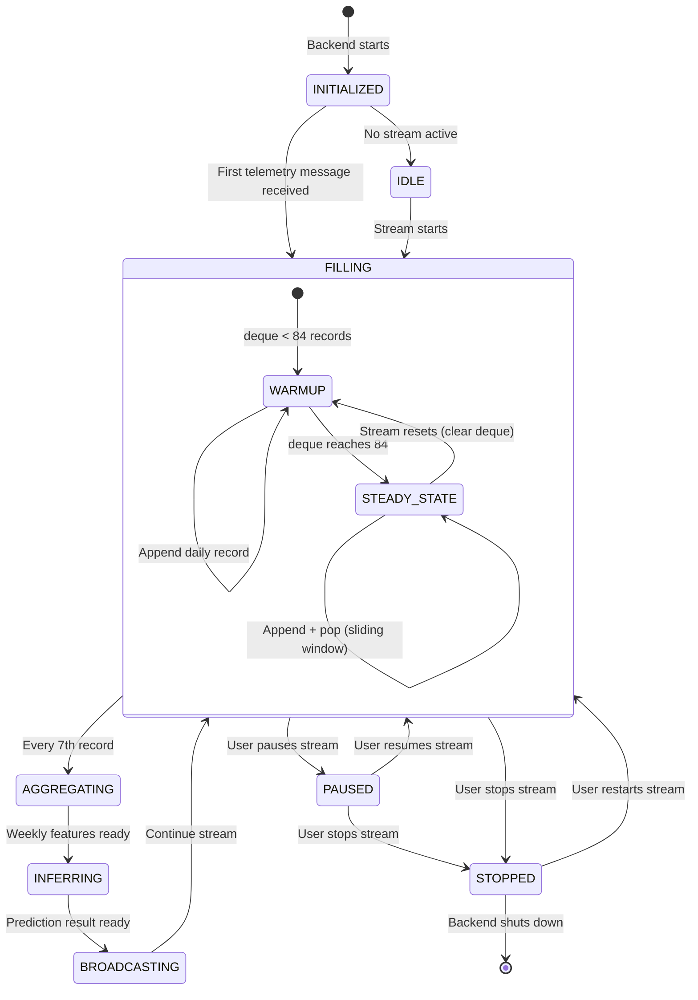

# UML Diagrams — Cognitive Digital Twin (Presentation 2)

Detailed UML diagrams reflecting the actual implementation, mapped to `Format_for slide_presentation_2.docx` slides 3–5.

---

## Table of Contents

1. [Updated Use Case Diagram (v2)](#1-use-case-diagram-v2)
2. [Updated Class Diagram (v3)](#2-class-diagram-v3)
3. [Sequence Diagram: Predict Crop Failure via DAG](#3-sequence-diagram-predict-crop-failure)
4. [Architecture Diagram (v2)](#4-architecture-diagram-v2--4-layer)
5. [State Diagram: FarmState Lifecycle](#5-state-diagram-farmstate-lifecycle)
6. [Appendix: Comparison to PPT-1](#appendix-comparison-to-presentation-1-diagrams)

---

## 1. Use Case Diagram (v2)

**Changes from v1 (Presentation 1):**
- Added `Monitor Real-Time Telemetry Stream` (live telemetry feed)
- Added `Toggle Virtual Sensor` (start/pause/stop replay)
- Added `Receive Alerts` (notifications on threshold breach)
- Split `Check Crop Failure Risk` into `Get Yield Forecast` + `Get Failure Risk` (maps to DAG query types)
- Removed `Sync Seasonal Yield Data` (Govt API integration not implemented)
- Actor `Researcher` renamed to `Agricultural Analyst`

**Use Case Descriptions:**

| UC ID | Name | Primary Actor | Trigger | Result |
|-------|------|--------------|---------|--------|
| UC-01 | View District Yield Trends | Analyst | User selects district + season | Historical yield chart |
| UC-02 | Get Yield Forecast | Analyst / Farmer | User clicks district on map | Predicted yield (Q/Acre) |
| UC-03 | Get Failure Risk | Analyst | User requests risk assessment | Failure probability + triggers |
| UC-04 | Run What-If Simulation | Analyst | User adjusts climate sliders | Counterfactual yield comparison |
| UC-05 | Query Advisory LLM | Analyst / Farmer | User types natural language question | Expert advisory response |
| UC-06 | Monitor Real-Time Telemetry | Analyst | Virtual sensor publishes telemetry | Live telemetry feeds into state |
| UC-07 | Toggle Virtual Sensor | Analyst | User clicks Start/Pause/Stop | Stream state changes |
| UC-08 | View Live Twin Dashboard | Analyst | WebSocket push from backend | Real-time yield + telemetry update |
| UC-09 | Receive Alert | Farmer | Failure probability > threshold | Notification (in-app/Telegram) |

---

## 2. Class Diagram (v3)

**Changes from v1 (Presentation 1) → v2 → v3:**
- `Model` abstract class replaced by concrete `CDTPredictor` with real methods
- `RFModel` removed (RF was dropped, XGBoost used instead)
- `LSTMAttention` now mirrors actual PyTorch class
- Added `GraphState` (orchestrator's shared state object)
- Added `DAGOrchestrator` with fixed 5-node routing
- Added `FarmState` with 84-day `deque` sliding window
- Added `VirtualSensor` (standalone telemetry publisher)
- Added `ConnectionManager` (WebSocket broadcast utility)
- `SimulationEngine` merged into `CDTPredictor.monte_carlo()`
- `Dashboard` split into `App` + `LiveTwinSimulator` (React components)

---

## 3. Sequence Diagram 1: Predict Crop Failure

**Flow:** User clicks a district → Frontend calls API → DAG routes to model nodes → Compiled response → Dashboard renders

**Shows:** The `full_diagnosis` route (all 5 nodes).

---

## 4. Architecture Diagram (v2 — 4-Layer)

**Changes from v1 (Presentation 1):**
- Message Broker added as external component
- `VirtualSensor` publishes CSV replay → message broker → subscriber
- `FarmState` (deque buffers) added as persistent twin state
- `WebSocket /ws/farm-stream` replaces polling for live updates
- `React 19` replaces "Next.js", `Custom DAG` replaces "LangGraph"
- RF removed, XGBoost standalone with stacking meta-learner

---

## 5. State Diagram: FarmState Lifecycle

**Shows:** How the digital twin state evolves over time, transitioning through different phases as virtual sensor data streams in.

---

## Appendix: Comparison to Presentation 1 Diagrams

| Aspect | Presentation 1 (Planned) | Presentation 2 (Built) |
|--------|-------------------------|----------------------|
| **Use Cases** | 6 use cases, 2 actors | 9 use cases, 3 actors (+ message broker) |
| **Class Diagram** | Abstract `Model` → `RFModel`, `LSTMModel` | Concrete `CDTPredictor` with 5 sub-models, `DAGOrchestrator`, `FarmState` |
| **Sequence Diagrams** | 1 (Predict Crop Failure) | 1 (Predict Crop Failure via DAG) |
| **Architecture** | LangGraph + Next.js | Custom DAG + React 19 + message broker |
| **Unique Elements** | Planned UML-style | Real code-mapped: `GraphState`, `QueryType` enum, MC dropout, telemetry subscriber, streaming thread |
| **Actor Types** | Analyst, Farmer, NASA, Govt API | Analyst, Farmer, **Message Broker** (virtual infrastructure) |

