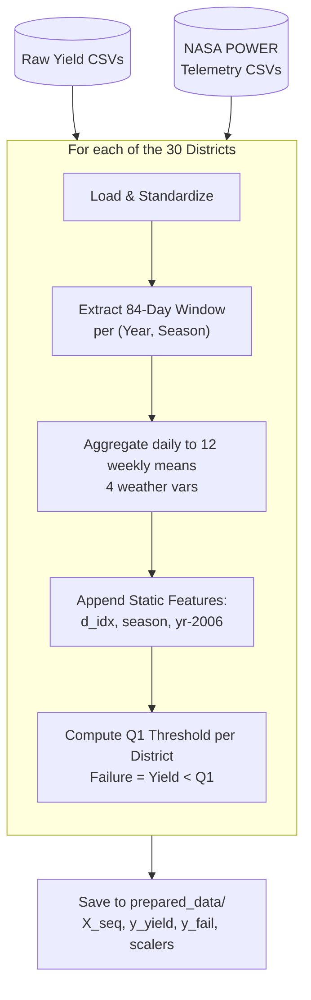

# Algorithm 1: Data Ingestion & Harmonization Pipeline (`prepare_data.py`)

## Visual Flowchart (Mermaid)

## Brief

**Input:** Govt yield CSVs + NASA POWER daily telemetry (4 vars).
**Output:** Synchronized tensors `X_seq (1113, 84, 4)`, `y_yield`, `y_fail`, scalers.

**Steps:**
1. Extract 84-day window per (district, year, season) — Kharif: Jun 15, Rabi: Nov 1
2. Aggregate 84 daily records → 12 weekly means per variable
3. Append static features: `[district_idx, season_onehot, year-2006]`
4. Compute Q₁ (25th percentile) threshold per district×season → label `failure = yield < Q₁`
5. Scale features → save tensors + encoders

**Key novelty:** Absolute year offset (`year-2006`) preserves temporal generalization across post-COVID yield regime shifts. Dual-target engineering prepares data for both regression (yield) and classification (failure) simultaneously.
