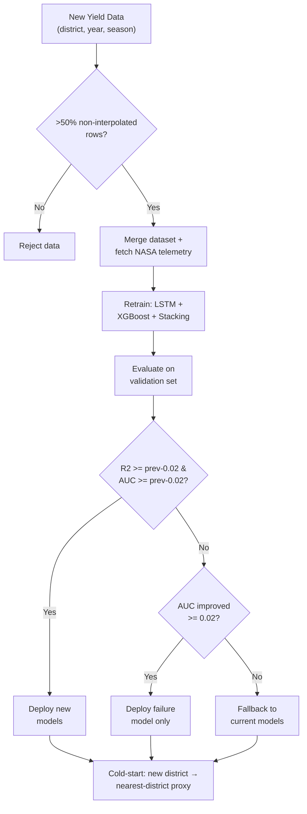

# Algorithm 2: Digital Twin State Update Algorithm

## Visual Flowchart (Mermaid)



## Brief

**Input:** New yield record(s) for a (district, year, season).
**Output:** Updated or preserved model state in the deployed twin.

**Steps:**
1. **Validate** — new record must have >50% non-interpolated rows; reject if insufficient ground truth
2. **Merge** — combine with existing dataset, fetch missing NASA telemetry for gap years
3. **Retrain** — run full pipeline (LSTM 200 epochs, XGBoost 500 trees, stacking calibration)
4. **Evaluate** — compare new model's R² and AUC against current deployed model on held-out validation set
5. **Decide** — deploy if new R² ≥ prev R² − 0.02 AND AUC ≥ prev AUC − 0.02; if only failure AUC improved, deploy failure model alone; otherwise fallback to current models
6. **Cold-start** — if a new district appears with no history, use nearest-district yield distribution as proxy

## Mathematical Decision Rule

```
Let M_old = currently deployed model with metrics (R²_old, AUC_old)
Let M_new = retrained model with metrics (R²_new, AUC_new)
Tolerance ε = 0.02

Deploy M_new if:    R²_new ≥ R²_old − ε  AND  AUC_new ≥ AUC_old − ε
Deploy M_new_fail only if:  AUC_new − AUC_old ≥ ε  (failure improved significantly)
Fallback otherwise: keep M_old, log regression
```

**Key novelty:** Unlike static ML pipelines that deploy every retrain blindly, this algorithm enforces a **metric-gated deployment** with degradation tolerance. It ensures the digital twin never silently regresses — if retraining hurts performance, the system safely falls back to the proven model.
