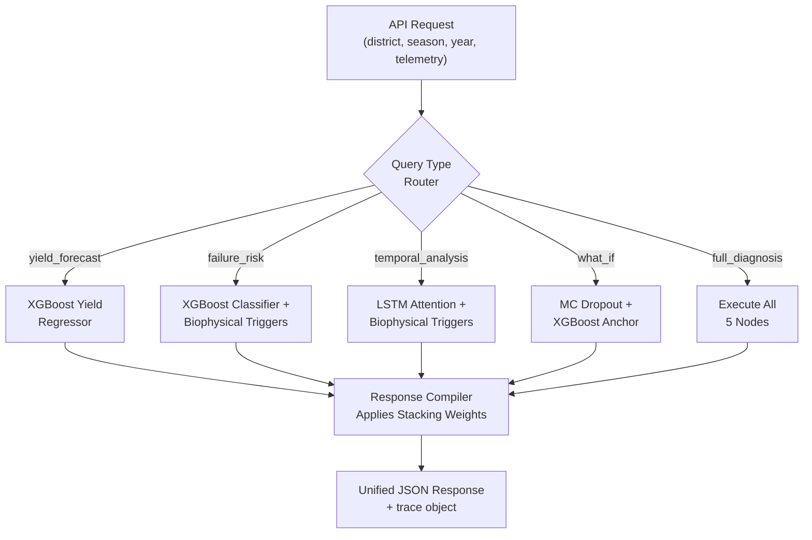

# Algorithm 3: Multi-Model Prediction Ensemble (DAG Orchestrator)

## Visual Flowchart (Mermaid)

## Models Used

| Model | Role |
|---|---|
| **LSTM-Attention** (84-step, 56K params) | Temporal feature extraction |
| **XGBoost Regressor** (23 features) | Yield prediction |
| **XGBoost Classifier** | Failure risk + triggers |
| **Ridge Meta-Learner** | Blends LSTM + XGB outputs |

## Brief

**Input:** API request with query type + 48-dim telemetry vector.
**Output:** Unified JSON with blended predictions + orchestration trace.

**Steps:**
1. Classify intent into one of 5 query types (yield_forecast, failure_risk, temporal_analysis, what_if, full_diagnosis)
2. Route through DAG — activate only the required model nodes
3. Compute predictions at each activated node
4. Blend using calibrated Ridge meta-learner weights (yield: 0.2L/0.8X, failure: 0.68L/0.32X)

**Key novelty:** Minimal compute path — yield_forecast skips LSTM and MC Dropout entirely (saves ~40ms). Calibrated stacking weights leverage each model's strength: XGBoost dominates yield, LSTM dominates failure detection.
