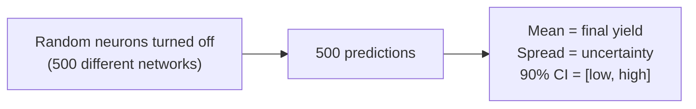

# Algorithm 4: Monte Carlo Dropout for Uncertainty Quantification

## Visual

## Math

| What | How |
|---|---|
| Each pass | Random 20% neurons disabled → different yield |
| Final prediction | Average of all 500 predictions |
| Uncertainty | Standard deviation of the 500 predictions |
| 90% CI | 5th to 95th percentile (sorted) |

## Brief

**Input:** Telemetry vector + district/season/year.
**Output:** Yield prediction with 90% confidence interval + standard deviation.

**What it does:**
- Normally during inference, dropout is turned off (all neurons active)
- Here we **keep dropout on** — each pass randomly turns off different neurons
- Run 500 times → get 500 slightly different predictions
- The spread of those 500 predictions = the model's **uncertainty**

**Steps:**
1. Feed telemetry through LSTM with dropout active
2. Repeat 500 times → collect 500 yield predictions
3. Sort them → 90% CI = value at position 25 to value at position 475
4. Blend each sample with XGBoost (via stacking) for final distribution

**Downstream uses:** What-If simulation (modify weather → see new CI), trigger evaluation, LLM advisory.

**Key novelty:** Gives farmers a confidence range instead of a single number — "14.2 Q/Acre, but likely between 12.1 and 16.3." No extra probabilistic model needed.
