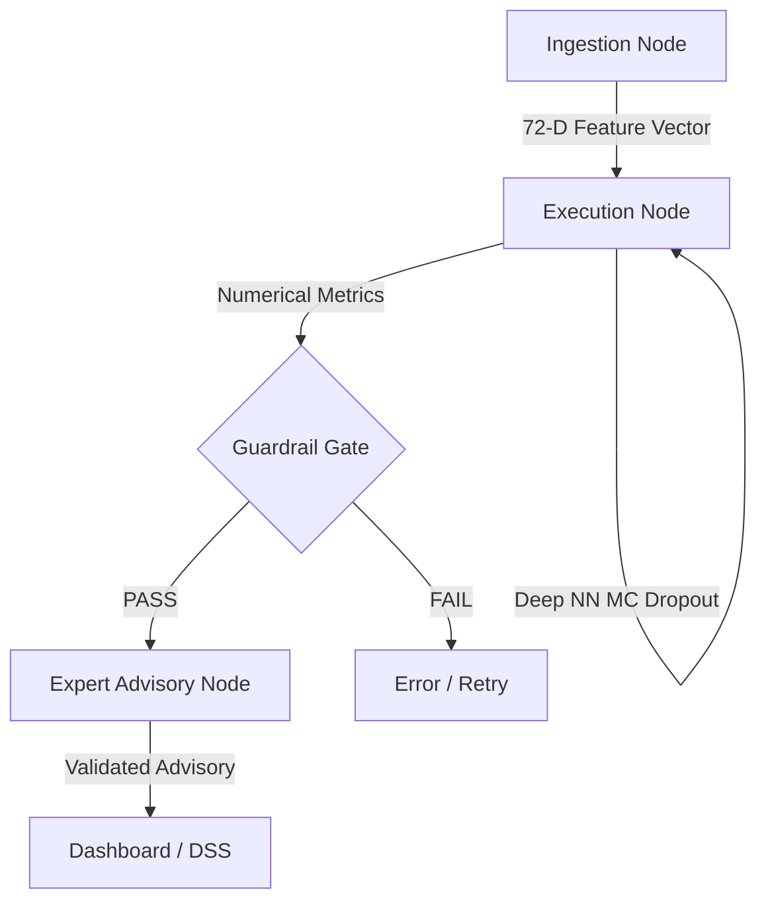
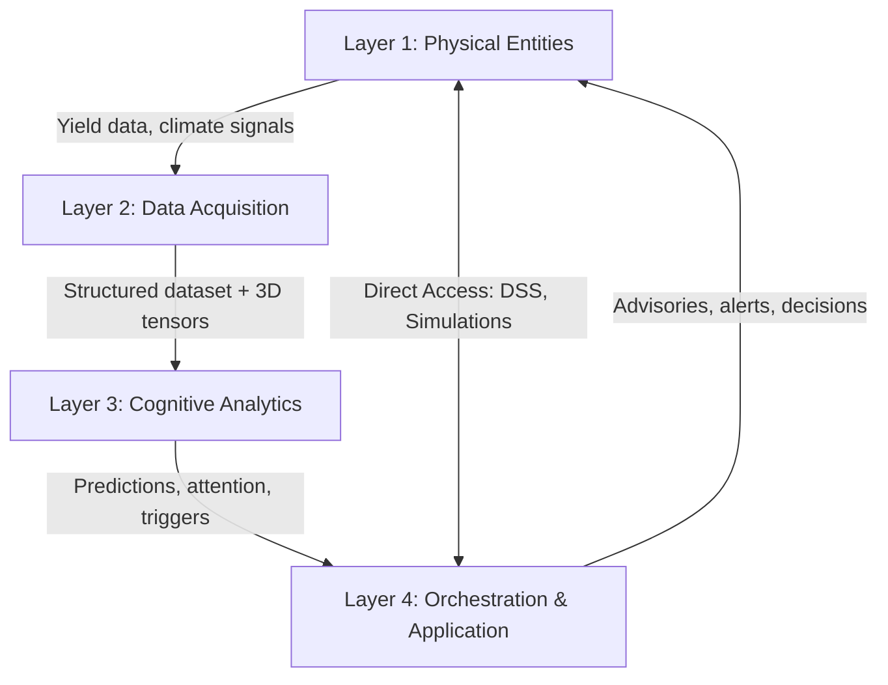

# Cognitive Digital Twin — Architecture

> **Terminology Update**: The project architecture has been finalized as a **Cognitive Digital Twin (CDT)**, replacing the earlier "Cyber-Physical Digital Twin (CPDT)" label. "Cognitive" reflects the ML/DL prediction brain and LLM-driven advisory reasoning that form the core of the system.

The CDT framework shifts agricultural forecasting from static, retrospective government reports to an active, continuous, data-driven prediction and advisory loop. It is organized into **4 distinct layers** with bidirectional feedback.

---

## Layer 1: Physical Entity Layer
> *The real-world agricultural system being twinned*

| Entity | Role in the Twin |
|--------|-----------------|
| **Farmers** | End users who consume advisories, interact with the DSS, and close the feedback loop by taking field-level decisions |
| **Agricultural Fields** | Paddy fields across 30 districts — the spatial units being modeled |
| **Rice Crop** | Target variable — Kharif (monsoon, Jun–Nov) and Rabi (winter, Nov–Apr) seasons |
| **Climate System** | Driving force — monsoon patterns, temperature, humidity, soil wetness |
| **30 Districts of Odisha** | Spatial granularity for predictions |
| **Agronomic Practices** | Controllable variables — sowing, irrigation, fertilizer, pesticide |

---

## Layer 2: Data Acquisition Layer
> *Hybrid data collection from heterogeneous sources*

| Source | Data | Pipeline |
|--------|------|----------|
| Dept. of Agriculture, Odisha | Historical yield/area/production (1997–2019) | [[Yield Data Harmonization]] |
| Advance Estimates | Recent 2024–2025 season data | [[Yield Data Harmonization]] |
| NASA POWER API | Daily Precip, Temp, RH, Soil Wetness (2006–2026) | [[NASA POWER Integration]] |
| District Centroids | Lat/Lon for 30 districts | Hardcoded lookup |

Automated pipelines: `harmonize_yield.py` → `fetch_nasa_telemetry.py` → `merge_telemetry_yield.py`

**Output**: `final_dataset.csv` (1,200 × 58) + 3D Tensor (1200 × 12 × 4)

---

## Layer 3: Cognitive Analytics Layer
> *The twin's brain — prediction, failure detection, and simulation*

### 3A. Feature Engineering
- 12-week tensor builder — aggregates daily telemetry into vegetative cycle windows
- Tabular flattening — per-season mean/std/min/max statistics (48 features)

### 3B. Prediction Engine (Dual-Model Ensemble)
| Model | Role | Input | Purpose |
|-------|------|-------|---------|
| **XGBoost** | Primary predictor | 72 engineered features | Fast, accurate tabular prediction with native non-linearity and outlier robustness |
| **Deep NN + MC Dropout** | Uncertainty quantifier | 72 engineered features | Bayesian approximation via Monte Carlo Dropout — provides predictive distribution and confidence intervals |

*Replaces prior Track A (RF+XGBoost) and Track B (LSTM-Attention). LSTM-Attention was removed after evaluation showed R²=0.048 (effectively random). See [[Prediction Engine: Dual-Model Ensemble]].*

### 3C. Failure Detection
- **$Q_1$ Thresholding**: Binary anomaly flag per district-season (Ref: [[Failure Logic]])
- **Biophysical Trigger Mapping**: Drought, Thermal Sterility, Pest/Pathogen Risk, Submergence Flooding — validated against XGBoost feature importances

### 3D. Simulation Engine
| Mode | Description |
|------|-------------|
| **Monte Carlo Uncertainty** | N=500 MC Dropout forward passes through Deep NN → predictive distribution with 90% CI |
| **What-If Scenarios** | User-adjusted climate tensors fed through frozen ensemble → counterfactual predictions |

---

## Layer 4: Orchestration & Application Layer
> *Agent-driven intelligence + human-facing interface*

### 4A. LangGraph DAG Orchestration

**Guardrails** — The LLM advisory is structurally blocked until:
- Yield prediction is within valid range (0–10,000 kg/ha)
- Attention weights sum to ~1.0
- At least 1 biophysical trigger is evaluable
- Monte Carlo std < 50% of mean

### 4B. Agentic Decision Support System (DSS)
A conversational AI agent embedded in the dashboard with tool access:

| Tool | Capability |
|------|-----------|
| `query_dataset()` | SQL-like queries on the 1,200-row dataset |
| `run_prediction()` | Feed custom inputs to trained models |
| `run_simulation()` | Monte Carlo with user-specified climate scenarios |
| `get_failure_risk()` | Biophysical trigger analysis for any district |
| `compare_districts()` | Side-by-side district comparison |
| `explain_prediction()` | Map attention weights → triggers → plain language |

### 4C. Interactive Dashboard
| Component | Description |
|-----------|-------------|
| **Odisha Map** | Dual-mode SVG/GIS toggle with choropleth coloring |
| **Prediction Cards** | Yield, Failure Probability, Dominant Stress, Confidence |
| **Simulation Panel** | Climate sliders + week selector → real-time what-if |
| **DSS Chat** | Sidebar chat for the agentic decision support system |
| **Attention Heatmap** | 12-week heatmap with climate sparklines |
| **Monte Carlo Viz** | Uncertainty distribution (histogram/violin) |
| **Advisory Alerts** | NLP-generated crop advisories and risk warnings |

---

## Feedback Loops

The feedback loops elevate this from a prediction pipeline to a **digital twin**:

### Loop 1: Information Flow (↑)
New season data + daily telemetry flows upward through Layers 2 → 3 → 4. The twin recomputes predictions as fresh data arrives.

### Loop 2: Action & Decision Flow (↓)
Layer 4 generates advisories → Farmer acts in Layer 1 (irrigates, sprays) → Physical world changes → New telemetry captured → Twin detects change → Updated predictions.

### Loop 3: Direct Interaction (↔)
Farmers (Layer 1) directly access Layer 4 — query the DSS, run what-if simulations, receive personalized alerts. This is the human-in-the-loop that closes the cycle.

---

## Sources
- [[Prediction Engine: Dual-Model Ensemble]]
- [[Failure Logic]]
- [[NASA POWER Integration]]
- [[Yield Data Harmonization]]
- [[Yan-2025]]
- [[Kenneth-2026]]
