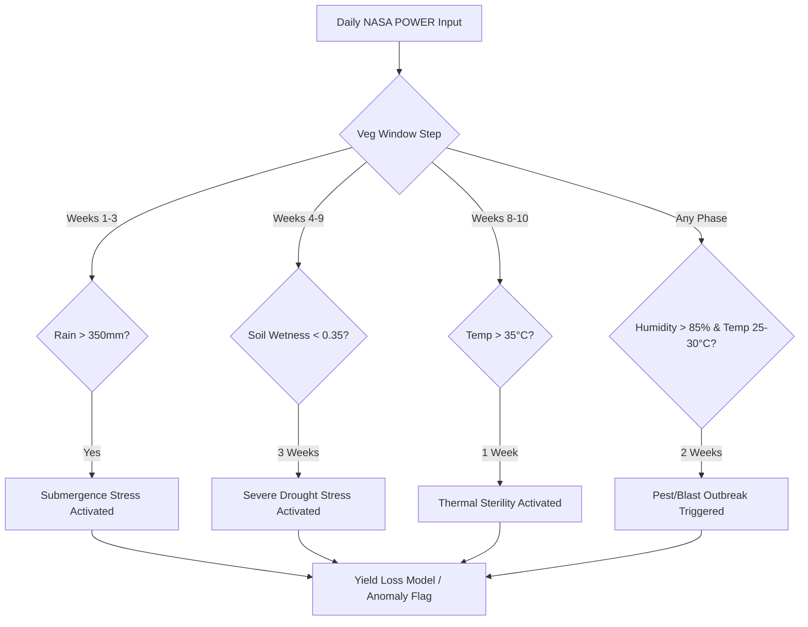

# Failure Logic & Biophysical Triggers

This concept page details the statistical and biophysical failure logic used by the Cognitive Digital Twin (CDT) to detect and explain crop anomalies and yield deficits in the Odisha Pilot region. This logic resides in **Layer 3: Cognitive Analytics Layer** (sub-component 3C) and feeds directly into both the **What-If Simulation Engine** (3D) and the **Agentic DSS** in Layer 4.

## 1. Statistical Failure Definition ($Q_1$ Logic)
From a pure regression-to-classification mapping, a crop failure anomaly is defined relative to the historical yield distribution of a specific administrative district ($d$) and crop season ($s$):

$$Y_{\text{class}}(d, y, s) = \begin{cases} 1 & \text{if } \text{Yield}(d, y, s) < Q_1\big(\mathbf{Yield}(d, \cdot, s)\big) \\ 0 & \text{otherwise} \end{cases}$$

Where:
- $\text{Yield}(d, y, s)$ is the actual yield in Quintals/Acre for district $d$, year $y$, and season $s$.
- $Q_1\big(\mathbf{Yield}(d, \cdot, s)\big)$ is the first quartile (25th percentile) of the historical yield distribution for that district and season over the 20-year baseline.

---

## 2. Biophysical Failure Triggers
While the statistical label provides a binary target, the physical layer of the Digital Twin models the underlying weather patterns that trigger crop stress. The four primary biophysical triggers mapped from NASA POWER climate telemetry features are:

### A. Drought & Water Deficit Trigger
Rice requires continuous moisture during the critical vegetative and panicle initiation phases (Weeks 4 to 9).
- **Trigger Condition**: Root Zone Soil Wetness (`GWETROOT`) drops below $0.35$ ($35\%$) or cumulative weekly precipitation (`PRECTOTCORR`) is below $30\text{ mm}$ for **three consecutive weeks** during the vegetative window.
- **Biochemical Impact**: Stomatal closure, reduced transpiration, and stunted panicle development, leading to floret abortion.

### B. Extreme Thermal Stress Trigger
Rice is highly sensitive to extreme heat during the anthesis (flowering) phase (typically occurring in Weeks 8 to 10 of the crop calendar).
- **Trigger Condition**: Mean weekly temperature (`T2M`) exceeds $35^\circ\text{C}$ for **more than 7 consecutive days** during the reproductive phase.
- **Biochemical Impact**: Spikelet sterility due to poor anther dehiscence and pollen grain desiccation, leading to direct yield collapse.

### C. Biotic/Pest Outbreak Risk Trigger
High humidity coupled with moderate temperatures creates an optimal microclimate for fungal infections like Rice Blast (*Magnaporthe oryzae*) and insect vectors.
- **Trigger Condition**: Mean weekly relative humidity (`RH2M`) exceeds $85\%$ and mean temperature (`T2M`) is between $25^\circ\text{C}$ and $30^\circ\text{C}$ for **two consecutive weeks**.
- **Biochemical Impact**: Fungal spore germination and rapid pest propagation, causing neck blast and hopper burn.

### D. Submergence/Flooding Trigger
Excessive rainfall during early growth (Weeks 1 to 3) can fully submerge young rice seedlings.
- **Trigger Condition**: Weekly cumulative precipitation (`PRECTOTCORR`) exceeds $350\text{ mm}$ in a single week.
- **Biochemical Impact**: Seedling hypoxia and physical lodging, causing crop washout.

---

## 3. Stress Activation Flow
The digital twin simulation models the progression of daily climate states through a Directed Acyclic Graph (DAG) state machine to identify trigger points:

---

## 4. LSTM-Attention Mapping (XAI)
The Track B Sequential model uses temporal attention to map weights ($a_1 \dots a_{12}$) across the 12 vegetative weeks. The Expert Advisory Node integrates these attention weights with our biophysical rules to generate natural language explanations:
- If a failure is predicted and attention weight peaks at Week 6 (where `GWETROOT` was $<0.30$), the system alerts: *"Failure anomaly predicted due to severe moisture stress during vegetative growth in Week 6."*

## Sources
- [[CPDT-Crop-Failure-Prediction Spec]]
- [[NASA POWER Integration]]
- [[Comparative Analysis-2026]]
